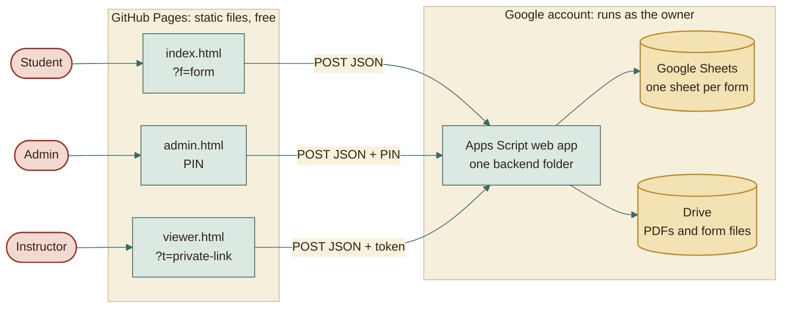

# Forms Platform

Many forms from one admin dashboard: team registration, task submission,
reservations, and WhatsApp group registration. Each form has its own link
and its own Google Sheet. No server to rent: the website is static
(GitHub Pages) and the backend is a Google Apps Script that stores
everything in Google Sheets.



**To put it online, follow [docs/DEPLOY.md](docs/DEPLOY.md).** The only code you
edit is the web app address in `assets/js/config.js`.

## Requirements checklist

Status: **Done** means built and covered by automated tests. **Done, check live**
means built and tested against a faithful in-memory copy of Google, but the last
step needs the real Google services (see "What could not be tested here").

### Forms and admin
| Requirement | Status |
|---|---|
| Many forms from one admin dashboard, each with its own link (`?f=name`) and its own Google Sheet | Done |
| Four form types: team registration, task submission, reservation, WhatsApp registration | Done |
| Admin dashboard protected by a PIN (stored hashed, wrong guesses lock it for a while) | Done |
| Create, duplicate for a new term, open or close with dates, rename or hide questions, add a description under any question | Done |
| **Team members are mandatory: admin sets the minimum and maximum team size per form** | Done |
| **Students pick the total team size first; exactly that many member forms then appear** | Done |
| A note for chosen team sizes (for example "other students will be added to reach 5" on 3 and 4), written by the admin in English and Arabic | Done |
| Title built from settings, e.g. "Database Team Project Registration Form" plus a term tag. No "Clean Code", no "Form Nº" | Done |
| Editable lists behind dropdowns (levels, bylaws, majors, sections, groups) | Done |

### Student experience
| Requirement | Status |
|---|---|
| English by default with an Arabic switch (RTL), mobile first, light and dark themes | Done |
| Light paper palette with strong contrast, **no logo**, defined font sizes, bold labels, italic helper text | Done |
| Arabic-only name fields: English letters and digits are removed while typing and on paste, with a hint saying why; at least four name parts; checked again on the server | Done |
| English-only project and task titles, Egyptian phone normalization, 7-digit codes | Done |
| Drive links must open and be shared with anyone who has the link | Done, check live |
| Two-step review before sending | Done |
| Success ticket: reference, key with an arrow callout, expiry, "take a screenshot" note, Save as image, Save as PDF, Copy key | Done |
| Duplicate leader code says "use your key" | Done |

### Edit key
| Requirement | Status |
|---|---|
| 5 random digits, shown once and emailed, expiring after a per-form number of days (default 7) | Done |
| The key alone opens the registration; wrong guesses are throttled silently (10 per minute per form) | Done |
| Edit or cancel; cancelling frees the code and the slot | Done |
| Admin can reset a lost key | Done |

### Reservations
| Requirement | Status |
|---|---|
| Week, day, and time slots from a generator; one team per slot (capacity adjustable) | Done |
| One booking per leader code; taken slots crossed out for students | Done |
| Warning when a timetable change leaves existing bookings without a slot | Done |

### Sheets, dashboards, and printing
| Requirement | Status |
|---|---|
| Google Sheets: every team is a block with a heavy border and alternating tints, a star on the leader, one merged project or task cell | Done |
| Admin dashboard uses the same pattern: tinted blocks with heavy borders between teams | Done |
| Print team list and print a day's reservations from a sheet menu and from the dashboard, with PDF export | Done, check live |
| WhatsApp split screen: pasted request numbers matched to registrations by phone, timetable preview, approve or reject, two review steps | Done |
| CSV download of any form | Done |

### Instructors and clients
| Requirement | Status |
|---|---|
| Private read-only links, no Google login | Done |
| Today, by day, or all; search; print | Done |
| Admin chooses hidden columns (removed on the server, never sent) and whether the link can review | Done |
| Links can be turned off, replaced, or deleted | Done |

### Excel export
| Requirement | Status |
|---|---|
| `scripts/download_tasks.py` downloads every task as a real `.pptx` and builds `Tasks.xlsx` with the same merged, tinted layout | Done |
| Relative links inside `Tasks.xlsx` so the whole folder can be moved | Done (desktop Excel only) |
| Links that cannot be downloaded are listed on a Failed sheet | Done |

## What could not be tested here

Be aware of these when you go live. They are checked on your first real run:

- **Real Google services.** Tests run against an in-memory copy of Sheets, Drive,
  Mail, and the cache. The real "does this Drive link open for anyone" check,
  the PDF export, the emails, and the 5-minute formatting timer only run on
  Google. Try each once after deploying (the guide has a checklist).
- **`admin.html` is a public page.** Anyone can open it, but it does nothing
  without the PIN, and wrong PINs lock it. Pick a PIN that is not guessable.
- **Excel links.** The relative links in `Tasks.xlsx` open in desktop Excel.
  Excel on the web and some phone apps cannot open local files.
- **Fonts** come from Google Fonts. Without internet the page falls back to
  system serif fonts and still works.
- **Image and PDF of the ticket** depend on the student's browser; the page
  tells them to take a screenshot as a fallback.

## Project layout

See [docs/MODULES.md](docs/MODULES.md). In short: `index.html`, `admin.html`,
`viewer.html` and `assets/` are the website; `backend/` is the Apps Script;
`shared/rules.js` holds the validation rules used by the browser, the backend,
and the tests alike, so they can never disagree; `scripts/` holds the bundler
and the Excel export; `tests/` holds the automated tests.

## Working on it

```
npm install          # once, installs the browser test library
npm test             # 145 tests: rules, backend, form page, dashboard, instructor page
npm run build        # writes dist/Code.gs and dist/appsscript.json to paste into Apps Script
npm run dev          # local preview on http://localhost:8080 (PIN 4321), in memory, no Google needed
python3 -m unittest discover -s tests -p "test_*.py"   # 20 tests for the Excel export
```

Commit style is described in [docs/COMMIT_CONVENTION.md](docs/COMMIT_CONVENTION.md).
Generated files (`dist/`, `node_modules/`) are not committed.

## Documentation

Start with [docs/README.md](docs/README.md). It links the architecture, the
23 workarounds that make free hosting enough, what builds `dist/`, what GitHub
and Google each do, the data model, security, and testing.
