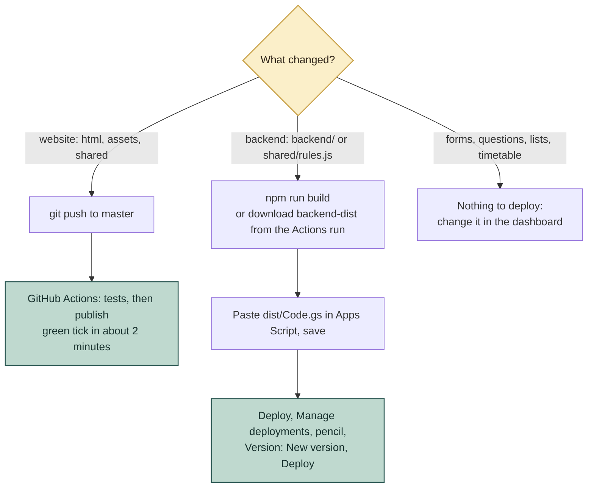

# Putting it online, step by step

You need: a Google account, a free GitHub account, and about 20 minutes.
Nothing here needs a credit card.

You will use two files from this project:

- `dist/Code.gs`: the whole backend in one file
- `dist/appsscript.json`: its settings

(If `dist/` is missing, run `npm install` then `npm run build` in the project
folder and it appears.)

## The whole thing at a glance

```mermaid
%%{init: {
  'theme': 'base',
  'themeVariables': {
    'fontFamily': 'ui-sans-serif, system-ui, -apple-system, Segoe UI, Roboto, sans-serif',
    'fontSize': '15px',
    'primaryColor': '#DCE9E2', 'primaryBorderColor': '#3F6B66', 'primaryTextColor': '#2F2418',
    'secondaryColor': '#F0E4C8', 'secondaryBorderColor': '#C9A24A', 'secondaryTextColor': '#2F2418',
    'tertiaryColor': '#F6EFDC', 'tertiaryBorderColor': '#CDBB94', 'tertiaryTextColor': '#2F2418',
    'lineColor': '#3F6B66', 'textColor': '#2F2418', 'mainBkg': '#DCE9E2', 'nodeBorder': '#3F6B66',
    'clusterBkg': '#F6EFDC', 'clusterBorder': '#CDBB94', 'titleColor': '#2F2418',
    'edgeLabelBackground': '#F8F1DD',
    'actorBkg': '#DCE9E2', 'actorBorder': '#3F6B66', 'actorTextColor': '#2F2418', 'actorLineColor': '#8FB3AB',
    'signalColor': '#477A73', 'signalTextColor': '#477A73',
    'labelBoxBkgColor': '#F0E4C8', 'labelBoxBorderColor': '#C9A24A', 'labelTextColor': '#2F2418', 'loopTextColor': '#6A5A44',
    'noteBkgColor': '#FBEFC9', 'noteBorderColor': '#C9A24A', 'noteTextColor': '#2F2418',
    'activationBkgColor': '#DCE9E2', 'activationBorderColor': '#3F6B66', 'sequenceNumberColor': '#F8F1DD',
    'transitionColor': '#3F6B66', 'stateLabelColor': '#2F2418', 'stateBkg': '#DCE9E2', 'altBackground': '#F6EFDC',
    'attributeBackgroundColorOdd': '#F8F1DD', 'attributeBackgroundColorEven': '#F0E4C8'
  },
  'flowchart': {'curve': 'basis', 'padding': 14, 'nodeSpacing': 40, 'rankSpacing': 46},
  'sequence': {'mirrorActors': false, 'messageMargin': 34, 'boxMargin': 8}
}}%%
flowchart TD
    subgraph P1["Part 1: the backend, in Google"]
        a1["1. Create the Forms Registry sheet"] --> a2["2. Paste dist/Code.gs and appsscript.json"]
        a2 --> a3["3. Menu: First-time setup, allow permissions"]
        a3 --> a4["4. Menu: Set admin PIN"]
        a4 --> a5["5. Deploy as web app: Execute as Me, access Anyone"]
    end
    a5 -- "copy the address that ends in /exec" --> b1
    subgraph P2["Part 2: the website, on GitHub"]
        b1["6. Paste the address into assets/js/config.js"] --> b2["7. Push to GitHub"]
        b2 --> b3["8. Settings, Pages: Source GitHub Actions"]
        b3 --> b4["9. Back in the sheet: Set website address"]
    end
    b4 --> c1
    subgraph P3["Part 3: use it"]
        c1["Open admin.html and enter the PIN"] --> c2["New form, set it to Open"]
        c2 --> c3["Copy the link and send it to students"]
    end
    classDef cDb fill:#F3E2B3,stroke:#B8892D,stroke-width:1.5px,color:#2F2418
    classDef cActor fill:#F4D9D3,stroke:#9A3328,stroke-width:1.5px,color:#2F2418
    classDef cDec fill:#FBEFC9,stroke:#C9A24A,stroke-width:1.5px,color:#2F2418
    classDef cEnd fill:#2F2418,stroke:#2F2418,color:#F8F1DD
    classDef cErr fill:#F6D5CF,stroke:#A12B1F,stroke-width:1.5px,color:#5A140C
    classDef cOk fill:#BFD9CF,stroke:#2E5A55,stroke-width:1.5px,color:#17302D
```



The only code you edit is one line in `assets/js/config.js`.

---

## Part 1: The backend (Google)

### 1. Create the registry sheet
1. Open **sheets.google.com** and click **Blank spreadsheet**.
2. Click the title at the top-left ("Untitled spreadsheet") and rename it **Forms Registry**.

### 2. Paste the backend
1. In that sheet click **Extensions**, then **Apps Script**. A new tab opens.
2. In the left panel click the file **Code.gs**. Select everything in the editor (Ctrl+A) and delete it.
3. Open `dist/Code.gs` from this project in any text editor, copy everything (Ctrl+A, Ctrl+C), and paste it into the Apps Script editor.
4. Click the **gear icon** (Project Settings) in the left panel. Tick **Show "appsscript.json" manifest file in editor**.
5. Click the **Editor** icon (`<>`) in the left panel. A new file **appsscript.json** now appears. Click it, select everything, delete it, and paste the content of `dist/appsscript.json`.
6. Press **Ctrl+S** to save. If asked for a project name, type **Forms Platform**.

### 3. First-time setup
1. Go back to the **Forms Registry** sheet tab and **reload the page** (F5). Wait about 5 seconds.
2. A new menu **Forms Platform** appears next to Help. Click it, then **1. First-time setup**.
3. Google asks for permission. Click **Continue**, choose your account, then:
   - If you see "Google hasn't verified this app", click **Advanced**, then **Go to Forms Platform (unsafe)**. This message appears because the script is yours and was never submitted to Google. It is safe: you are giving the script access to *your own* account.
   - Click **Allow**.
4. Click **Forms Platform > 1. First-time setup** again. A message says the setup finished. This creates the Forms, Lists, and Clients tabs and a Drive folder called **Forms Platform**.

### 4. Choose the admin PIN
1. Click **Forms Platform > 2. Set admin PIN...**
2. Type a PIN with at least 4 characters and press OK. Pick something not easy to guess: the admin page is public, and the PIN is the only lock.

### 5. Publish the backend as a web app
1. In the Apps Script tab click the blue **Deploy** button at the top-right, then **New deployment**.
2. Click the **gear icon** next to "Select type" and choose **Web app**.
3. Fill in:
   - Description: `Forms Platform`
   - **Execute as: Me** (your account)
   - **Who has access: Anyone**
4. Click **Deploy**. Approve the permission screen again if it appears.
5. Copy the **Web app URL**. It ends with `/exec`. Keep it open; you need it in Part 2.

---

## Part 2: The website (GitHub Pages)

### 6. Tell the website where the backend is
1. Open `assets/js/config.js` in a text editor.
2. Replace `PASTE_YOUR_WEB_APP_URL_HERE` with the URL you copied. Keep the quotes:
   ```js
   window.APP_CONFIG = {
     API_URL: 'https://script.google.com/macros/s/AKfy.../exec'
   };
   ```
3. Save the file. This is the only code edit in the whole project.

### 7. Upload to GitHub
1. On **github.com** click **+**, then **New repository**. Name it, for example, `forms`. Choose **Public** (free Pages needs public) and click **Create repository**.
2. In the project folder run:
   ```
   git remote add origin https://github.com/YOUR-NAME/forms.git
   git push -u origin master
   ```
   (Or use GitHub's **Add file > Upload files** and drag the project folder contents in. Do not upload `node_modules`.)

### 8. Turn on GitHub Pages
1. In the repository click **Settings**, then **Pages** in the left list.
2. Under **Build and deployment**, set **Source** to **GitHub Actions**. Nothing else to fill in: the workflow in `.github/workflows/pages.yml` does the rest.
3. Open the **Actions** tab. The run **Test and deploy site** starts on every push to `master`: it runs all tests, and only if they pass it publishes `index.html`, `admin.html`, `viewer.html`, `assets/`, and `shared/`. If a run is not there yet, click **Test and deploy site**, then **Run workflow**.
4. Wait for the green tick (about a minute) and refresh the Pages settings. It shows your site address:
   `https://YOUR-NAME.github.io/forms/`

### 9. Tell the sheet your website address (for emails)
Back in the Forms Registry sheet: **Forms Platform > 3. Set website address...** and paste the address from step 8. Confirmation emails link to it.

---

## Part 3: Use it

1. Open `https://YOUR-NAME.github.io/forms/admin.html` and enter your PIN.
2. Click **New form**, choose a type, give it a title, pick the term (Fall, Spring, or Summer and the year), type the subject code, and click **Create form**.
3. On the settings page check:
   - **Who can register**: all specializations, or only some (for example Computers only).
   - **Team size**: minimum and maximum people per team (counting the leader), and an optional note for some sizes (for example "other students will be added to reach 5" for 3 and 4).
   - **Questions**: rename, hide, or add a description under any question.
   - **Emails**: whether students get a confirmation email.
   - **Limits and checks**: the Drive folder name rule `Team_Leader_Name_Project_Name_Subject_Name` (on by default for new team forms). Type the subject name, for example `Software Engineering`, so folders must end with `_Software_Engineering`.
   - **Timetable** for reservations: set the session hours, then add days by date.
   - **Status**: set to **Open** and click **Save settings**.
4. Click **Copy link** and send it to students. The link looks like `.../index.html?f=database-team-project-registration-form-fall-2027`.
5. Watch submissions under **Responses**. Each form's own Google Sheet is one click away (**Google Sheet**).
6. For instructors: **Clients > New private link**. Send them the link shown once. They need no account.

### First-run checklist (things only real Google can confirm)
Do these once with a test form:

- [ ] Register a team with a real Drive link shared to "Anyone with the link": accepted.
- [ ] Register another with a link set to private: refused with a clear message.
- [ ] Register with a folder named with spaces (for example `My Project`): refused, and the message shows the expected name such as `Ahmed_Mohamed_My_Project_Software_Engineering`.
- [ ] Check that the confirmation email arrived with the key.
- [ ] Open the form's Google Sheet: teams show as tinted blocks with heavy borders.
- [ ] In the dashboard click **Print team list**: a print tab and a PDF appear.
- [ ] Open an instructor link on a phone.

---

## Part 4: Excel list with the real files (on your computer)

1. Install Python 3 once. In the project folder run `pip install -r scripts/requirements.txt`.
2. Run (replace the name with your form's link name, the part after `?f=`):
   ```
   python scripts/download_tasks.py --slug database-tasks-fall-2027
   ```
3. Type your admin PIN when asked.
4. Open `Tasks_Export/database-tasks-fall-2027/Tasks.xlsx` in desktop Excel. Click a task name to open its downloaded `.pptx`. Keep `Tasks.xlsx` and the `files` folder together. Anything that could not be downloaded is on the **Failed** sheet with the reason (usually a link that is not shared with "Anyone with the link").

---

## Updating later



**Website changed**: commit and push to `master`. The **Test and deploy site**
workflow runs the tests and publishes the site; the change is live when the run
shows a green tick. A red cross means a test failed and the old site stays up:
open the run to see which test. Hard-refresh the page (Ctrl+F5) if your browser
still shows the old version.

**Backend changed** (anything in `backend/` or `shared/rules.js`): run
`npm run build`, or download the **backend-dist** artifact from the latest
Actions run. In Apps Script paste the new `Code.gs` over the old, save, then
**Deploy > Manage deployments**, click the pencil, set **Version: New version**,
and **Deploy**. The web app address does not change. A change to
`shared/rules.js` needs both: the push (browser copy) and the new version
(server copy).

### Optional: Automatic backend deployment via Google clasp & GitHub Actions

If you prefer to automate backend updates on every push to `master`:

1. Visit [script.google.com/home/usersettings](https://script.google.com/home/usersettings) and toggle **Google Apps Script API** to **ON**.
2. Install clasp locally and log in:
   ```bash
   npm install -g @google/clasp
   clasp login
   ```
3. In your Apps Script project editor, go to **Project Settings** (gear icon) and copy the **Script ID**.
4. Update `.clasp.json` in your project root with your Script ID:
   ```json
   {
     "scriptId": "YOUR_SCRIPT_ID",
     "rootDir": "./dist"
   }
   ```
5. Copy the **entire JSON file content** from `~/.clasprc.json` (do not copy just an individual token string like `access_token` or `refresh_token`; clasp needs the whole object including `token`, `oauth2ClientSettings`, and expiration metadata):
   ```bash
   cat ~/.clasprc.json
   ```
6. In your GitHub repository, go to **Settings > Secrets and variables > Actions > New repository secret**:
   - **Name:** `CLASPRC_JSON`
   - **Secret:** paste the entire JSON string starting from `{` to `}` exactly as printed.
   - (Optional) Add secret/variable `APPS_SCRIPT_DEPLOYMENT_ID` if using a custom deployment ID instead of the default found in `assets/js/config.js`.
7. Whenever you push to `master`, GitHub Actions will run tests, bundle `dist/Code.gs`, push to Apps Script, and update your live deployment version automatically.

## If something goes wrong

| What you see | What to do |
|---|---|
| Form page says it is not connected to the backend | `assets/js/config.js` still has the placeholder, or the file was not pushed. |
| Page says it could not reach the server | The web app was not deployed with **Who has access: Anyone**. Redeploy (step 5). |
| "That PIN is not correct" | Wrong PIN, or too many tries: wait a few minutes. To reset, run **Forms Platform > 2. Set admin PIN...** again. |
| Changes to the backend have no effect | You saved the code but did not create a **New version** of the deployment. |
| The site did not change after a push | Open the **Actions** tab: a red run means a test failed and nothing was published. A green run means the browser cached the old file: press Ctrl+F5. |
| Actions says Pages is not enabled | Settings, Pages, Source: **GitHub Actions**. |
| The menu "Forms Platform" is missing | Reload the sheet and wait a few seconds. |

---

## Want to know why it works this way?

| Question | Read |
|---|---|
| Why only one config line, and why no server? | [HOSTING.md](architecture/HOSTING.md) |
| What exactly is `dist/Code.gs`, and who builds it? | [BUILD-PIPELINE.md](architecture/BUILD-PIPELINE.md) |
| Why "Execute as Me" and "Anyone" is safe here | [WORKAROUNDS.md](architecture/WORKAROUNDS.md) and [SECURITY.md](reference/SECURITY.md) |
| What is stored where? | [DATA-MODEL.md](reference/DATA-MODEL.md) |
| The whole picture | [ARCHITECTURE.md](architecture/ARCHITECTURE.md) |
