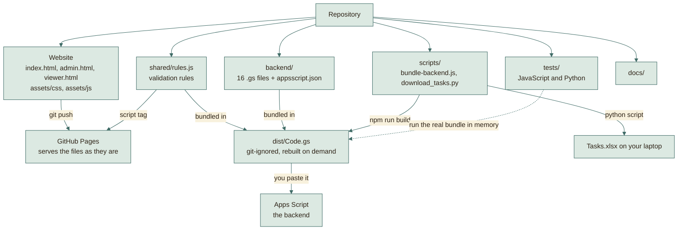
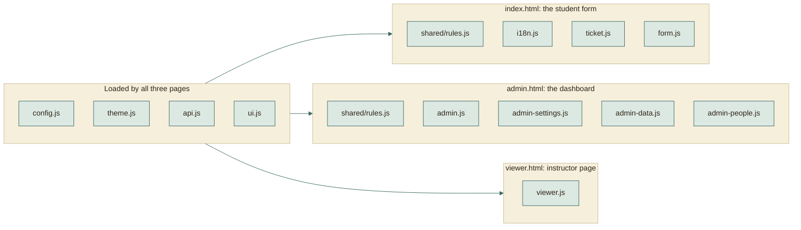
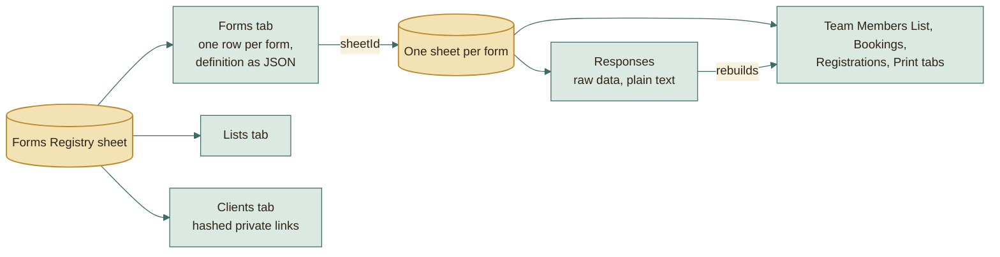

# How the project is organised

## The repository at a glance

Each folder goes somewhere different. Only one of them needs a build step.

## Which scripts each page loads

The pages share a few small files. Each file adds itself to one `App` object.

The instructor page does not load `rules.js`: it only reads data, so it needs
no validation.

## Website (static files, no build step)

| File | What it is |
|---|---|
| `index.html` | The page students use. Shows any form from its saved definition (`?f=name`). |
| `admin.html` | The admin dashboard (PIN). |
| `viewer.html` | The read-only instructor and client page (`?t=private-token`). |
| `assets/css/theme.css` | Colors, fonts, and the type scale as variables. Change the look here; the contrast standard is in its header and enforced by `tests/contrast.test.js`. |
| `assets/css/app.css` | Components of the student page. |
| `assets/css/admin.css` | Dashboard and instructor layout, including the team cards (a coloured band per team, header strip, leader tag). |
| `assets/img/` | The tab icon (`favicon.svg`), PNG sizes for phones and older browsers, and `site.webmanifest`. |
| `assets/js/config.js` | Source placeholder; `scripts/build-site.js` generates its published copy from the Actions `API_URL` variable. |
| `assets/js/api.js` | Sends requests to the backend as plain-text JSON (avoids browser CORS checks). |
| `assets/js/form.js`, `ticket.js`, `i18n.js` | The student page, the success ticket, English and Arabic text. |
| `assets/js/admin*.js` | Dashboard: core and forms list, settings, responses and matching, clients and lists. |
| `assets/js/viewer.js` | The instructor page. |
| `shared/rules.js` | Validation and normalization rules (Arabic names, phones, codes, Drive links, team size, slots). Used by the browser, the backend, and the tests, so all three always agree. |

## Backend (`backend/`, becomes one `Code.gs`)

| File | What it does |
|---|---|
| `Code.gs` | Entry point. Routes each request to its handler. |
| `Config.gs` | Constants and small helpers. |
| `Auth.gs` | Admin PIN (salted hash, lockout). |
| `Registry.gs` | The registry sheet: forms, lists, clients; setup. |
| `Templates.gs` | The four form types and the default lists, all as data. |
| `FormsApi.gs` | Create, update, and duplicate forms; the public form definition. |
| `Responses.gs` | Reading and writing rows, edit keys, limits, Drive checks, emails. |
| `Submissions.gs` | Student submit, lookup, update, cancel; admin edits and key reset. |
| `Slots.gs` | Reservation timetable checks and availability. |
| `Views.gs` | Tinted block views inside each form's Google Sheet. |
| `Print.gs` | Print tabs and PDF export. |
| `Menu.gs` | The "Forms Platform" menu in the registry sheet. |
| `Matching.gs` | WhatsApp request matching. |
| `Clients.gs`, `Viewer.gs` | Private instructor links and what they can see. |
| `Export.gs` | Team data for the Excel export script. |

`npm run build` joins `shared/rules.js` and every backend file into `dist/Code.gs`.

## Tools and tests

| Path | What it is |
|---|---|
| `scripts/bundle-backend.js` | The bundler. |
| `scripts/dev-server.js` | `npm run dev`: serves the site and answers its API calls from the in-memory Google, with sample forms, so pages can be opened in a real browser. |
| `scripts/download_tasks.py` | Downloads task files and builds `Tasks.xlsx`. |
| `tests/harness/appsscript-mock.js` | An in-memory Sheets, Drive, Mail, Cache, and clock, so the real backend code runs in tests. |
| `tests/harness/dom.js` | Opens the real pages in jsdom wired to that backend. |
| `tests/*.test.js` | 172 tests. |
| `tests/test_download_tasks.py` | 20 tests for the export, with a local server in place of Google. |

## Data model in one paragraph

The **Forms Registry** sheet has one row per form (its whole definition as JSON),
the shared lists, and the instructor links (only a hash of each link's secret is
stored). Each form owns a **separate spreadsheet** with a Responses tab (the raw
data), and the tinted views built from it. A form definition is plain data:
questions, steps, rules (including the team size range), slots, review steps. The
engine never hard-codes a question, which is why new forms need no code.

## Going deeper

| Question | Read |
|---|---|
| How does a request travel, and what runs where? | [ARCHITECTURE.md](architecture/ARCHITECTURE.md) |
| Why was it built this way? | [WORKAROUNDS.md](architecture/WORKAROUNDS.md) |
| What produces `dist/`? | [BUILD-PIPELINE.md](architecture/BUILD-PIPELINE.md) |
| What do GitHub and Google each do? | [HOSTING.md](architecture/HOSTING.md) |
| Every sheet and column | [DATA-MODEL.md](reference/DATA-MODEL.md) |
| Secrets and weak spots | [SECURITY.md](reference/SECURITY.md) |
| How the tests work | [TESTING.md](reference/TESTING.md) |
| Click-by-click setup | [DEPLOY.md](DEPLOY.md) |
