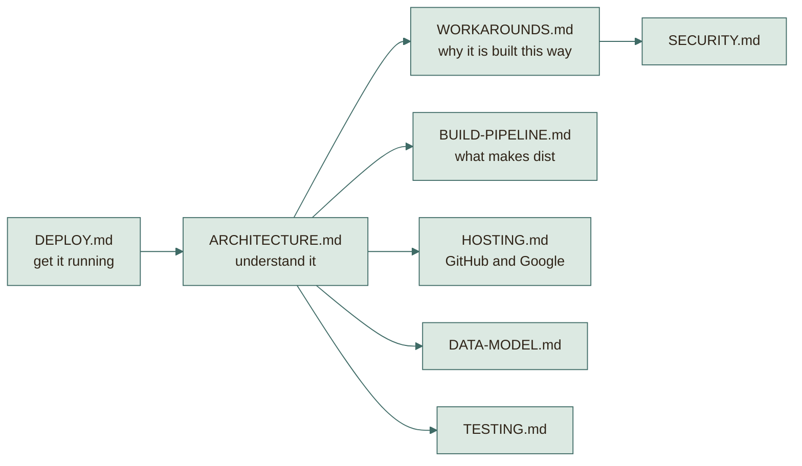

# Documentation

Start with **ARCHITECTURE.md** for the picture of the whole system, then read
whichever page answers your question.

| Document | Read it to learn |
|---|---|
| [ARCHITECTURE.md](architecture/ARCHITECTURE.md) | What runs where, how requests travel, every module, with diagrams |
| [WORKAROUNDS.md](architecture/WORKAROUNDS.md) | The 23 clever solutions that make free hosting enough, and their trade-offs |
| [BUILD-PIPELINE.md](architecture/BUILD-PIPELINE.md) | Exactly what produces `dist/`, why files can be joined safely, when to rebuild |
| [HOSTING.md](architecture/HOSTING.md) | What GitHub does, what Google does, how they fit, how updates flow |
| [DATA-MODEL.md](reference/DATA-MODEL.md) | Every sheet, column, stored property, and browser key |
| [SECURITY.md](reference/SECURITY.md) | The secrets, what protects them, and the honest weak spots |
| [TESTING.md](reference/TESTING.md) | How 191 tests run without Google, and what they cannot prove |
| [DEPLOY.md](DEPLOY.md) | Click-by-click setup and the first-run checklist |
| [MODULES.md](MODULES.md) | File-by-file reference |
| [COMMIT_CONVENTION.md](COMMIT_CONVENTION.md) | How commits and branches are written |

## How to read the diagrams

Colours carry meaning, and the same colours are used in every diagram.

```mermaid
%%{init: {
  'theme': 'base',
  'themeVariables': {
    'fontFamily': 'ui-sans-serif, system-ui, -apple-system, Segoe UI, Roboto, sans-serif',
    'fontSize': '15px',
    'primaryColor': '#DCE9E2', 'primaryBorderColor': '#3F6B66', 'primaryTextColor': '#2F2418',
    'secondaryColor': '#F0E4C8', 'secondaryBorderColor': '#C9A24A', 'secondaryTextColor': '#2F2418',
    'tertiaryColor': '#F6EFDC', 'tertiaryBorderColor': '#CDBB94', 'tertiaryTextColor': '#2F2418',
    'lineColor': '#3F6B66', 'textColor': '#2F2418', 'mainBkg': '#DCE9E2', 'nodeBorder': '#3F6B66',
    'clusterBkg': '#F6EFDC', 'clusterBorder': '#CDBB94', 'titleColor': '#2F2418',
    'edgeLabelBackground': '#F8F1DD',
    'actorBkg': '#DCE9E2', 'actorBorder': '#3F6B66', 'actorTextColor': '#2F2418', 'actorLineColor': '#8FB3AB',
    'signalColor': '#477A73', 'signalTextColor': '#477A73',
    'labelBoxBkgColor': '#F0E4C8', 'labelBoxBorderColor': '#C9A24A', 'labelTextColor': '#2F2418', 'loopTextColor': '#6A5A44',
    'noteBkgColor': '#FBEFC9', 'noteBorderColor': '#C9A24A', 'noteTextColor': '#2F2418',
    'activationBkgColor': '#DCE9E2', 'activationBorderColor': '#3F6B66', 'sequenceNumberColor': '#F8F1DD',
    'transitionColor': '#3F6B66', 'stateLabelColor': '#2F2418', 'stateBkg': '#DCE9E2', 'altBackground': '#F6EFDC',
    'attributeBackgroundColorOdd': '#F8F1DD', 'attributeBackgroundColorEven': '#F0E4C8'
  },
  'flowchart': {'curve': 'basis', 'padding': 14, 'nodeSpacing': 40, 'rankSpacing': 46},
  'sequence': {'mirrorActors': false, 'messageMargin': 34, 'boxMargin': 8}
}}%%
flowchart LR
    p(["Person or audience"]) --> s["A page, a system, or a step"]
    s --> d{"A decision"}
    d -- "fails" --> e["Error returned to the user"]
    d -- "passes" --> st[("Stored data")]
    st --> ok["Approved"]
    classDef cDb fill:#F3E2B3,stroke:#B8892D,stroke-width:1.5px,color:#2F2418
    classDef cActor fill:#F4D9D3,stroke:#9A3328,stroke-width:1.5px,color:#2F2418
    classDef cDec fill:#FBEFC9,stroke:#C9A24A,stroke-width:1.5px,color:#2F2418
    classDef cEnd fill:#2F2418,stroke:#2F2418,color:#F8F1DD
    classDef cErr fill:#F6D5CF,stroke:#A12B1F,stroke-width:1.5px,color:#5A140C
    classDef cOk fill:#BFD9CF,stroke:#2E5A55,stroke-width:1.5px,color:#17302D
    class st cDb
    class p cActor
    class d cDec
    class e cErr
    class ok cOk
```

| Colour | Means |
|---|---|
| Rose, rounded | A person or audience: student, admin, instructor |
| Teal | A page, a backend module, or a step |
| Amber diamond | A decision or a check |
| Gold cylinder | Stored data: a sheet, Drive, or a property |
| Red | An error the user sees |
| Green | A good outcome |

## Reading order

