# Architecture

This is the map of the whole platform: what runs where, how a request travels,
and why each piece exists. Other documents go deeper on one topic each; the
index is at the bottom.

## The idea in one paragraph

A student opens a web page. The page is a plain static file hosted for free on
GitHub Pages. When the student presses Send, the page posts a small piece of
JSON to a Google Apps Script web app. That script checks the answers with the
same rules the page used, writes a row into a Google Sheet, and answers with a
reference number and an edit key. There is no server to rent, no database to
run, no login for students, and no build step for the website. Everything an
admin changes (forms, questions, team sizes, time slots) is data stored in a
sheet, not code.

## Design principles

| Principle | What it means here |
|---|---|
| **No server, no bill** | GitHub Pages serves files; Apps Script runs the logic; Sheets and Drive store the data. All free for classroom scale. |
| **Visitors never log in** | The script runs as the owner. Students get an edit key; instructors get a private link; the admin gets a PIN. Each is its own small, hashed secret. |
| **One source of truth for rules** | `shared/rules.js` is used by the browser, the backend, and the tests. They cannot disagree. |
| **Forms are data** | A form is a JSON definition in one cell. New questions and new form types need no code. |
| **Boring technology** | Plain JavaScript, no framework, no bundler for the website, one concatenation script for the backend. Easy to read, easy to fix later. |
| **Testable without Google** | An in-memory copy of Google's services runs the real backend code, so 145 tests cover it without touching a real account. |

## System context

Who talks to what. Three static pages share one backend.

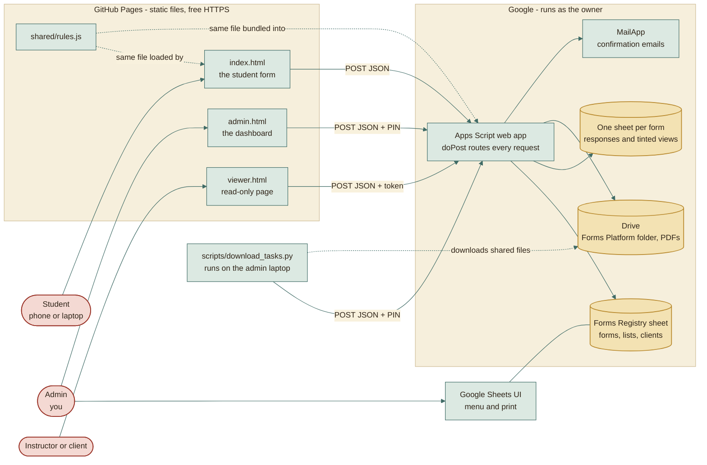

## What runs where

| Place | What runs there | Who pays | What it must never do |
|---|---|---|---|
| Visitor's browser | The page, live input filtering, draft saving, ticket image/PDF | Nobody | Be trusted. Every rule is checked again on the server. |
| GitHub Pages | Serves static files over HTTPS | Free | Run code or keep secrets. |
| Apps Script | All logic: validation, limits, keys, locking, emails, views | Free quotas | Hold state in memory. Every request starts fresh. |
| Google Sheets | The only database | Free | Be edited by hand in the Responses tab (the platform owns it). |
| Drive | Print PDFs, form sheets, student-shared files | Free | Be written by students. They only share links. |
| Admin laptop | Builds `dist/`, runs the Excel export | Nobody | Be required for students to use the forms. |

## Request lifecycle

Every action, from every page, takes the same path. This is the whole backend
entry point.

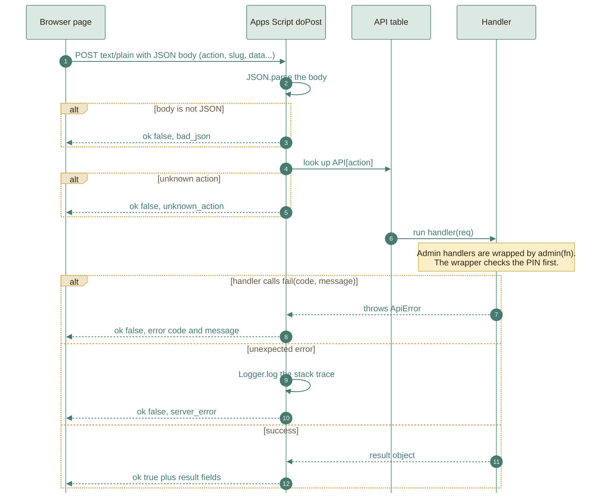

The response envelope is always `{ ok: true, ...fields }` or
`{ ok: false, error: { code, message, details } }`. The browser turns the
`code` into a friendly sentence in English or Arabic (`assets/js/i18n.js`).

## A student submits a registration

The most important flow. Validation happens twice on purpose: in the browser
for instant feedback, and on the server because the browser cannot be trusted.

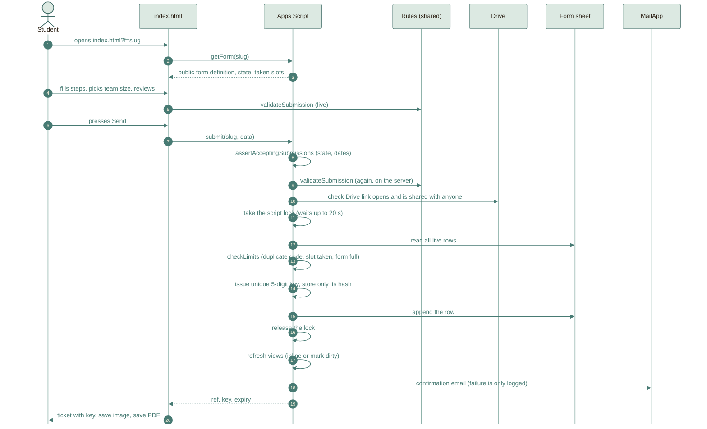

Two details worth knowing:

- The Drive check happens **before** the lock, because it is slow and does not
  touch the sheet. The lock is held only for the read-check-write sequence, so
  students are not queued behind network calls.
- The key is returned **once**. Only a salted hash is stored. Nobody, including
  the admin, can read a key back; the admin can only issue a new one.

## Editing or cancelling with a key

The key alone identifies the registration. That is a deliberate trade for
"no accounts", and the reason the key is salted per form, throttled, and
expiring. See [SECURITY.md](../reference/SECURITY.md).

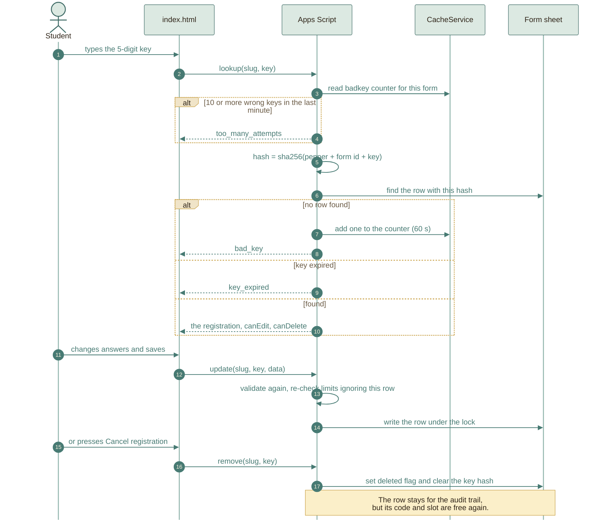

## Life of a form

A form has a stored status and optional dates. The state students actually see
is computed by `Rules.formState`, so the same function decides in the browser,
the backend, and the tests.

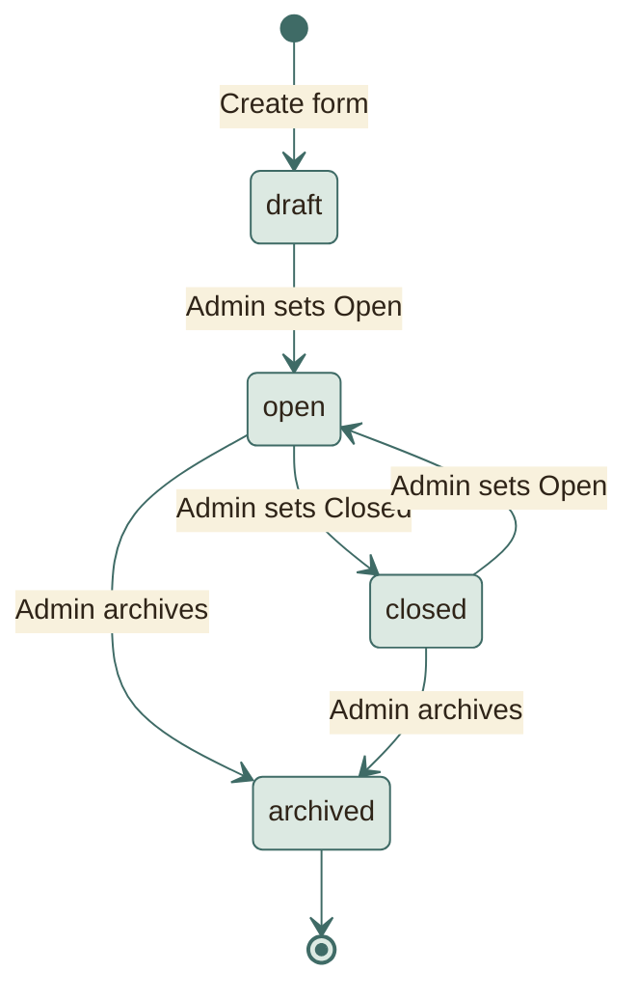

On top of the stored status, the optional dates are applied while it is
`open`:

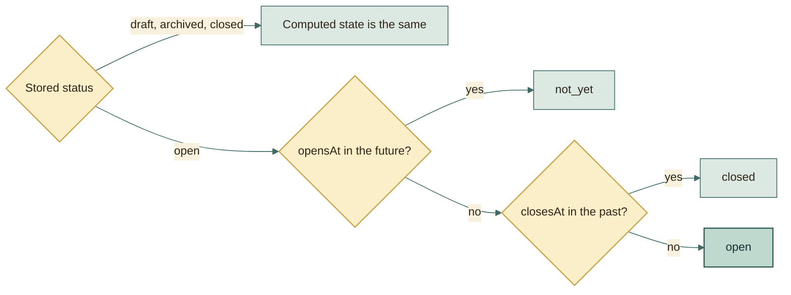

| Computed state | Students see |
|---|---|
| `draft` | "This form is not available yet." (its questions are not sent to the browser) |
| `not_yet` | "This form has not opened yet." |
| `open` | The form |
| `closed` | "This form is closed." (a message you can customise per form) |
| `archived` | Treated like closed for students; hidden from instructors |

## Team size: how "members are not optional" works

The admin sets a range. The student chooses a number. That number decides
exactly how many member forms exist, in the browser and on the server.

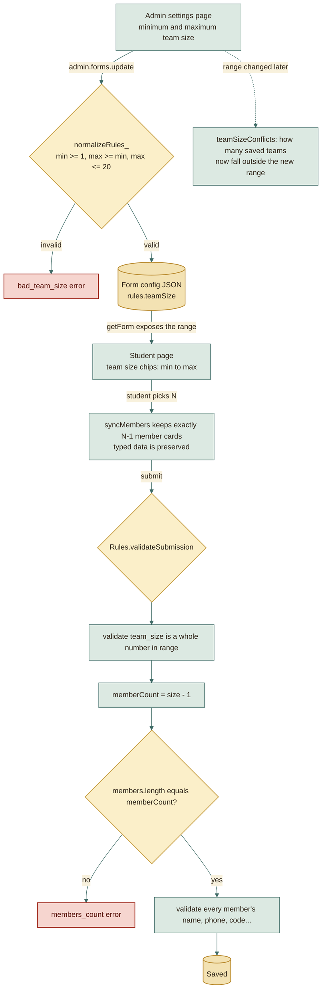

If a form hides the team size question, the member limits fall back to the
range (`min - 1` to `max - 1`), so older form definitions keep working.

## Reviews and WhatsApp matching

WhatsApp does not let a website read pending join requests. So the reviewer
pastes them and the platform matches by normalised phone number.

```mermaid
%%{init: {
  'theme': 'base',
  'themeVariables': {
    'fontFamily': 'ui-sans-serif, system-ui, -apple-system, Segoe UI, Roboto, sans-serif',
    'fontSize': '15px',
    'primaryColor': '#DCE9E2', 'primaryBorderColor': '#3F6B66', 'primaryTextColor': '#2F2418',
    'secondaryColor': '#F0E4C8', 'secondaryBorderColor': '#C9A24A', 'secondaryTextColor': '#2F2418',
    'tertiaryColor': '#F6EFDC', 'tertiaryBorderColor': '#CDBB94', 'tertiaryTextColor': '#2F2418',
    'lineColor': '#3F6B66', 'textColor': '#2F2418', 'mainBkg': '#DCE9E2', 'nodeBorder': '#3F6B66',
    'clusterBkg': '#F6EFDC', 'clusterBorder': '#CDBB94', 'titleColor': '#2F2418',
    'edgeLabelBackground': '#F8F1DD',
    'actorBkg': '#DCE9E2', 'actorBorder': '#3F6B66', 'actorTextColor': '#2F2418', 'actorLineColor': '#8FB3AB',
    'signalColor': '#477A73', 'signalTextColor': '#477A73',
    'labelBoxBkgColor': '#F0E4C8', 'labelBoxBorderColor': '#C9A24A', 'labelTextColor': '#2F2418', 'loopTextColor': '#6A5A44',
    'noteBkgColor': '#FBEFC9', 'noteBorderColor': '#C9A24A', 'noteTextColor': '#2F2418',
    'activationBkgColor': '#DCE9E2', 'activationBorderColor': '#3F6B66', 'sequenceNumberColor': '#F8F1DD',
    'transitionColor': '#3F6B66', 'stateLabelColor': '#2F2418', 'stateBkg': '#DCE9E2', 'altBackground': '#F6EFDC',
    'attributeBackgroundColorOdd': '#F8F1DD', 'attributeBackgroundColorEven': '#F0E4C8'
  },
  'flowchart': {'curve': 'basis', 'padding': 14, 'nodeSpacing': 40, 'rankSpacing': 46},
  'sequence': {'mirrorActors': false, 'messageMargin': 34, 'boxMargin': 8}
}}%%
flowchart LR
    paste["Reviewer pastes<br/>WhatsApp requests"] --> extract["Rules.extractPhones<br/>finds every phone in each line"]
    extract --> norm["normalizePhone<br/>+20 10 1234 5678 becomes 01012345678"]
    norm --> store[("Requests tab<br/>one row per phone, duplicates skipped")]
    store --> match["matching.list joins requests to registrations by phone"]
    reg[("Registrations")] --> match
    match --> st{"How many registrations<br/>share the phone?"}
    st -- "0" --> none["No match"]
    st -- "1" --> one["Matched"]
    st -- "2 or more" --> dup["Duplicate"]
    one --> screen["Split screen<br/>details and Drive preview"]
    screen --> dec["approve / reject / pending"]
    dec --> step["setReviewStep_ on the matched registration"]
    step --> rule{"Sequential steps?"}
    rule -- "approving step 2 before step 1" --> err["review_order: Finish step 1 first"]
    rule -- "ok" --> derive["status derived:<br/>any rejected = rejected<br/>all approved = approved<br/>some approved = in_review"]
    classDef cDb fill:#F3E2B3,stroke:#B8892D,stroke-width:1.5px,color:#2F2418
    classDef cActor fill:#F4D9D3,stroke:#9A3328,stroke-width:1.5px,color:#2F2418
    classDef cDec fill:#FBEFC9,stroke:#C9A24A,stroke-width:1.5px,color:#2F2418
    classDef cEnd fill:#2F2418,stroke:#2F2418,color:#F8F1DD
    classDef cErr fill:#F6D5CF,stroke:#A12B1F,stroke-width:1.5px,color:#5A140C
    classDef cOk fill:#BFD9CF,stroke:#2E5A55,stroke-width:1.5px,color:#17302D
    class store,reg cDb
    class st,rule cDec
    class dec,derive cErr
    class one cOk
```

## Backend modules

Sixteen small files that the bundler joins with `shared/rules.js`. They do not
import each other; they share one global scope (this is how Apps Script
works), and each file only declares functions or registers handlers.

```mermaid
%%{init: {
  'theme': 'base',
  'themeVariables': {
    'fontFamily': 'ui-sans-serif, system-ui, -apple-system, Segoe UI, Roboto, sans-serif',
    'fontSize': '15px',
    'primaryColor': '#DCE9E2', 'primaryBorderColor': '#3F6B66', 'primaryTextColor': '#2F2418',
    'secondaryColor': '#F0E4C8', 'secondaryBorderColor': '#C9A24A', 'secondaryTextColor': '#2F2418',
    'tertiaryColor': '#F6EFDC', 'tertiaryBorderColor': '#CDBB94', 'tertiaryTextColor': '#2F2418',
    'lineColor': '#3F6B66', 'textColor': '#2F2418', 'mainBkg': '#DCE9E2', 'nodeBorder': '#3F6B66',
    'clusterBkg': '#F6EFDC', 'clusterBorder': '#CDBB94', 'titleColor': '#2F2418',
    'edgeLabelBackground': '#F8F1DD',
    'actorBkg': '#DCE9E2', 'actorBorder': '#3F6B66', 'actorTextColor': '#2F2418', 'actorLineColor': '#8FB3AB',
    'signalColor': '#477A73', 'signalTextColor': '#477A73',
    'labelBoxBkgColor': '#F0E4C8', 'labelBoxBorderColor': '#C9A24A', 'labelTextColor': '#2F2418', 'loopTextColor': '#6A5A44',
    'noteBkgColor': '#FBEFC9', 'noteBorderColor': '#C9A24A', 'noteTextColor': '#2F2418',
    'activationBkgColor': '#DCE9E2', 'activationBorderColor': '#3F6B66', 'sequenceNumberColor': '#F8F1DD',
    'transitionColor': '#3F6B66', 'stateLabelColor': '#2F2418', 'stateBkg': '#DCE9E2', 'altBackground': '#F6EFDC',
    'attributeBackgroundColorOdd': '#F8F1DD', 'attributeBackgroundColorEven': '#F0E4C8'
  },
  'flowchart': {'curve': 'basis', 'padding': 14, 'nodeSpacing': 40, 'rankSpacing': 46},
  'sequence': {'mirrorActors': false, 'messageMargin': 34, 'boxMargin': 8}
}}%%
flowchart TD
    subgraph entry["Entry"]
        Code["Code.gs<br/>doGet, doPost, routing"]
        Menu["Menu.gs<br/>onOpen sheet menu"]
    end
    subgraph core["Core"]
        Config["Config.gs<br/>helpers, hashes, sheet tables, API table"]
        Auth["Auth.gs<br/>PIN, lockout, admin wrapper"]
        Registry["Registry.gs<br/>setup, forms, lists, triggers"]
        Templates["Templates.gs<br/>four form types as data"]
    end
    subgraph public["Student facing"]
        FormsApi["FormsApi.gs<br/>getForm, admin forms CRUD"]
        Submissions["Submissions.gs<br/>submit, lookup, update, remove"]
        Responses["Responses.gs<br/>rows, keys, limits, Drive checks, emails"]
        Slots["Slots.gs<br/>timetable and availability"]
    end
    subgraph admin["Admin and reviewers"]
        Views["Views.gs<br/>tinted sheet blocks"]
        Print["Print.gs<br/>print tabs and PDF"]
        Matching["Matching.gs<br/>WhatsApp matching"]
        Clients["Clients.gs<br/>private links"]
        Viewer["Viewer.gs<br/>read-only data"]
        Export["Export.gs<br/>team data for Excel"]
    end
    Rules["shared/rules.js<br/>pure validation"]

    Code --> Config
    Auth --> Config
    Registry --> Config
    FormsApi --> Registry
    Submissions --> Responses
    Submissions --> Rules
    Responses --> Rules
    Responses --> Config
    Slots --> Rules
    Views --> Responses
    Print --> Views
    Matching --> Responses
    Viewer --> Clients
    Viewer --> Responses
    Export --> Responses
    Templates --> Registry
    Menu --> Print
    Registry --> Views
    classDef cDb fill:#F3E2B3,stroke:#B8892D,stroke-width:1.5px,color:#2F2418
    classDef cActor fill:#F4D9D3,stroke:#9A3328,stroke-width:1.5px,color:#2F2418
    classDef cDec fill:#FBEFC9,stroke:#C9A24A,stroke-width:1.5px,color:#2F2418
    classDef cEnd fill:#2F2418,stroke:#2F2418,color:#F8F1DD
    classDef cErr fill:#F6D5CF,stroke:#A12B1F,stroke-width:1.5px,color:#5A140C
    classDef cOk fill:#BFD9CF,stroke:#2E5A55,stroke-width:1.5px,color:#17302D
```

## Frontend modules

No framework. Each file is a small self-contained script that adds itself to a
single `App` object. Loading order is set by the script tags in each HTML file.

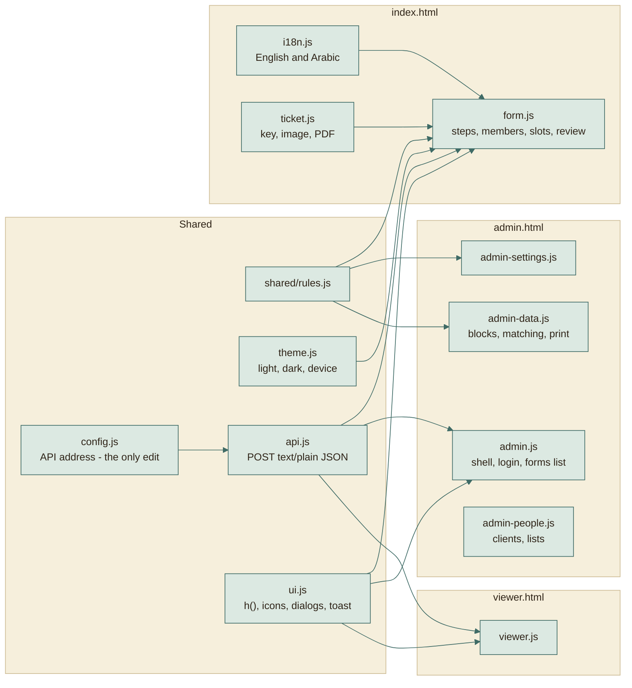

## How sheet views stay fast

Colouring a sheet is slow in Apps Script. The platform formats immediately for
small forms and defers for big ones, so a student never waits for formatting.

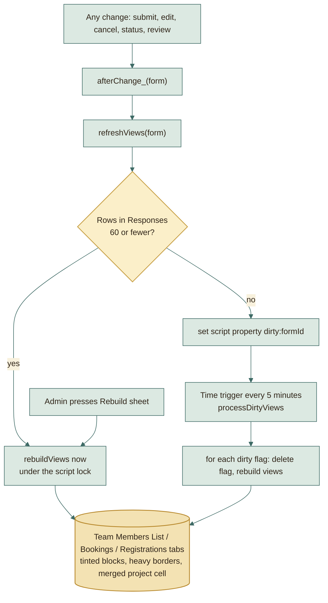

The trigger is installed by **First-time setup**. If it is ever missing, run
the setup again; it only creates it when absent.

## Excel export

Apps Script is a poor place to download dozens of files and zip them, so that
part runs on the admin's own computer.

```mermaid
%%{init: {
  'theme': 'base',
  'themeVariables': {
    'fontFamily': 'ui-sans-serif, system-ui, -apple-system, Segoe UI, Roboto, sans-serif',
    'fontSize': '15px',
    'primaryColor': '#DCE9E2', 'primaryBorderColor': '#3F6B66', 'primaryTextColor': '#2F2418',
    'secondaryColor': '#F0E4C8', 'secondaryBorderColor': '#C9A24A', 'secondaryTextColor': '#2F2418',
    'tertiaryColor': '#F6EFDC', 'tertiaryBorderColor': '#CDBB94', 'tertiaryTextColor': '#2F2418',
    'lineColor': '#3F6B66', 'textColor': '#2F2418', 'mainBkg': '#DCE9E2', 'nodeBorder': '#3F6B66',
    'clusterBkg': '#F6EFDC', 'clusterBorder': '#CDBB94', 'titleColor': '#2F2418',
    'edgeLabelBackground': '#F8F1DD',
    'actorBkg': '#DCE9E2', 'actorBorder': '#3F6B66', 'actorTextColor': '#2F2418', 'actorLineColor': '#8FB3AB',
    'signalColor': '#477A73', 'signalTextColor': '#477A73',
    'labelBoxBkgColor': '#F0E4C8', 'labelBoxBorderColor': '#C9A24A', 'labelTextColor': '#2F2418', 'loopTextColor': '#6A5A44',
    'noteBkgColor': '#FBEFC9', 'noteBorderColor': '#C9A24A', 'noteTextColor': '#2F2418',
    'activationBkgColor': '#DCE9E2', 'activationBorderColor': '#3F6B66', 'sequenceNumberColor': '#F8F1DD',
    'transitionColor': '#3F6B66', 'stateLabelColor': '#2F2418', 'stateBkg': '#DCE9E2', 'altBackground': '#F6EFDC',
    'attributeBackgroundColorOdd': '#F8F1DD', 'attributeBackgroundColorEven': '#F0E4C8'
  },
  'flowchart': {'curve': 'basis', 'padding': 14, 'nodeSpacing': 40, 'rankSpacing': 46},
  'sequence': {'mirrorActors': false, 'messageMargin': 34, 'boxMargin': 8}
}}%%
flowchart LR
    A["python scripts/download_tasks.py --slug name"] --> B["read API address from assets/js/config.js"]
    B --> C["POST admin.export.tasks with the PIN"]
    C --> D["teams, members, leader, link<br/>no phone numbers, no key data"]
    D --> E{"For each team link"}
    E -- "Slides" --> F["export as pptx"]
    E -- "Drive file" --> G["download, keep its own type"]
    E -- "private, deleted, folder" --> H["record the reason"]
    F --> I["files/001_Name.pptx"]
    G --> I
    D --> J["openpyxl builds Tasks.xlsx<br/>tinted blocks, merged task cell,<br/>relative hyperlink to files/"]
    I --> J
    H --> K["Failed sheet in Tasks.xlsx"]
    J --> K
    classDef cDb fill:#F3E2B3,stroke:#B8892D,stroke-width:1.5px,color:#2F2418
    classDef cActor fill:#F4D9D3,stroke:#9A3328,stroke-width:1.5px,color:#2F2418
    classDef cDec fill:#FBEFC9,stroke:#C9A24A,stroke-width:1.5px,color:#2F2418
    classDef cEnd fill:#2F2418,stroke:#2F2418,color:#F8F1DD
    classDef cErr fill:#F6D5CF,stroke:#A12B1F,stroke-width:1.5px,color:#5A140C
    classDef cOk fill:#BFD9CF,stroke:#2E5A55,stroke-width:1.5px,color:#17302D
    class E cDec
```

## Scale and honest limits

The design is right for a class, a department, or a few hundred registrations
per form. It is not meant for tens of thousands.

| Limit | Why | What to do if you hit it |
|---|---|---|
| Every request re-reads the rows it needs | Sheets is the database; there is no index | Fine up to low thousands of rows per form. Beyond that, move the heavy reads to a cache or a real database. Not implemented. |
| One script lock for all writes | Guarantees no two students take one slot | Writes queue briefly. A 20 second wait fails with "busy, try again". |
| Apps Script daily quotas (mail, runtime, URL fetch) | Google applies quotas to free accounts and Workspace differently | Check Google's current quota page. Confirmation emails are the quota most likely to matter. |
| A 5-digit key has 100,000 values | Chosen so students can type it | Safe because it is salted per form, throttled to 10 wrong tries a minute, and expires. |
| Real Google behaviour is untested locally | Tests use a faithful copy, not Google | Run the first-run checklist in [DEPLOY.md](../DEPLOY.md) once. |

## Where to change what

| I want to... | Edit |
|---|---|
| Change a colour, font, or size | `assets/css/theme.css` (variables only) |
| Reword a message or translate | `assets/js/i18n.js` |
| Add a question to a form | Admin dashboard, or `backend/Templates.gs` for new forms by default |
| Add a new form type | A new function in `backend/Templates.gs`, a label in `assets/js/admin.js` |
| Change a validation rule | `shared/rules.js` (browser, server, and tests all follow) |
| Add a backend action | A file in `backend/` that sets `API['name'] = ...` (wrap with `admin()` if private) |
| Change sheet colours | `backend/Views.gs` |
| Change the Excel layout | `scripts/download_tasks.py` |

## Documents

| File | Read it for |
|---|---|
| [WORKAROUNDS.md](WORKAROUNDS.md) | The clever solutions to each hosting constraint, and why |
| [BUILD-PIPELINE.md](BUILD-PIPELINE.md) | What produces `dist/`, step by step |
| [HOSTING.md](HOSTING.md) | What GitHub does, what Google does, and how they fit |
| [DATA-MODEL.md](../reference/DATA-MODEL.md) | Every sheet, column, and stored property |
| [SECURITY.md](../reference/SECURITY.md) | The secrets, who holds them, and what a leak would mean |
| [TESTING.md](../reference/TESTING.md) | How 165 tests run without Google |
| [DEPLOY.md](../DEPLOY.md) | Click-by-click setup |
| [MODULES.md](../MODULES.md) | File-by-file reference |
