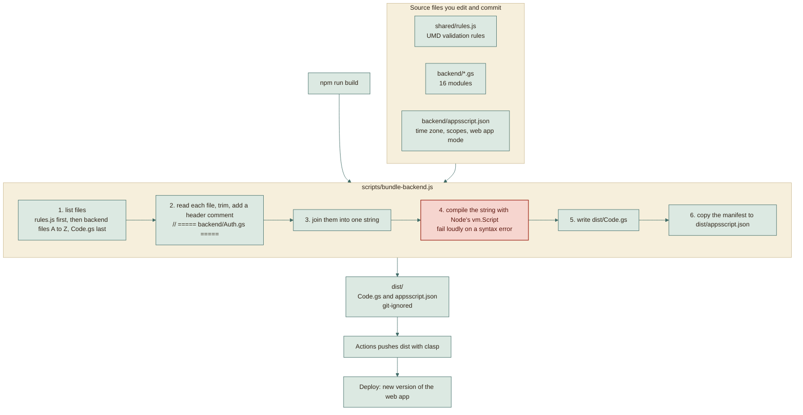
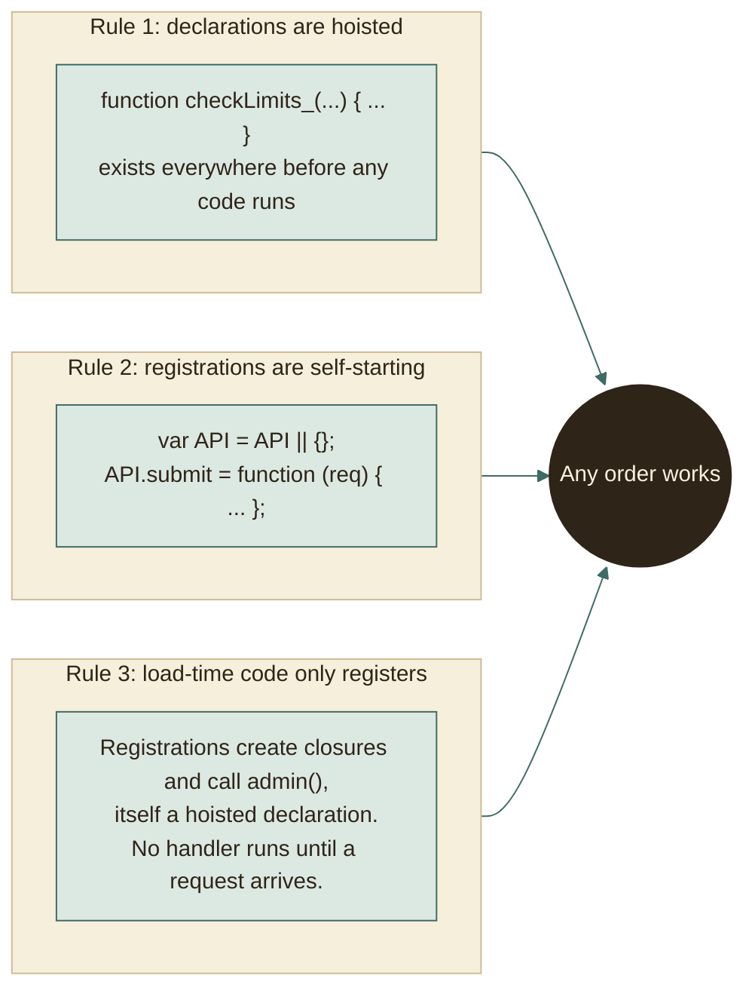
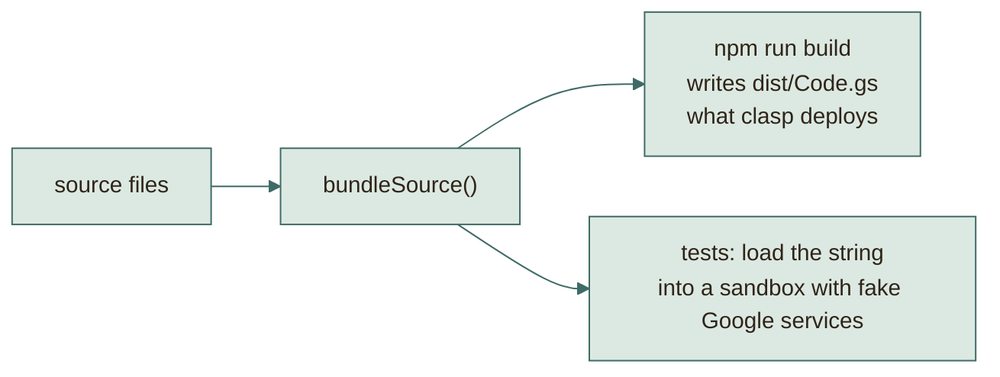

# Build pipeline: what produces `dist/`

The website needs **no build**. The backend needs **one small step**: joining
its source files into a single file that Apps Script accepts. This page
explains exactly what happens in that step, who runs it, and why nothing is
hidden.

## The short version

```
npm run build
```

runs `scripts/bundle-backend.js`, which writes two files into `dist/`:

| Output | Made from | You do |
|---|---|---|
| `dist/Code.gs` | `shared/rules.js` + every `backend/*.gs` | Actions pushes it with pinned clasp |
| `dist/appsscript.json` | `backend/appsscript.json` (copied as-is) | Actions pushes it with pinned clasp |

`dist/` is listed in `.gitignore`, so it is **not committed**. It is regenerated
from source whenever you need it, and the zip you downloaded contains a copy so
a first deploy needs no tooling.

## What compiles `dist`

Only one program: `scripts/bundle-backend.js`. Nothing else, not GitHub, not
Google, not a hidden service. It is about 50 lines of plain Node and uses only
Node's built-in modules (`fs`, `path`, `vm`).



### Step by step

1. **List the files.** `shared/rules.js` goes first so the global `Rules`
   exists. The backend files follow in alphabetical order, with `Code.gs`
   moved to the end (a one-line comparator in `listBackend`).
2. **Read and label.** Each file is trimmed and prefixed with a comment such as
   `// ===== backend/Auth.gs =====`, so when you read the pasted code in the
   Apps Script editor you can still see where every part came from.
3. **Join.** All parts become one string.
4. **Check it compiles.** `new vm.Script(code, { filename: 'Code.gs' })` makes
   Node parse the whole bundle. If anything is wrong (a missing bracket, a stray
   character) the build stops with the exact line. You find out on your laptop,
   not after pasting.
5. **Write** `dist/Code.gs`.
6. **Copy the manifest** to `dist/appsscript.json`. It carries three things
   Apps Script needs: the time zone (`Africa/Cairo`), the permission scopes
   (Sheets, Drive, mail, external requests, triggers, menu UI), and the web app
   defaults (execute as the deploying user, open to anyone).

Typical output:

```
Bundled 17 files into dist/Code.gs (97922 chars).
```

17 = `rules.js` + 16 backend files.

## Why joining files is safe

Concatenation breaks code when order matters. This project avoids that by
convention, so the bundler can stay simple:



One detail deserves a sentence. A registration such as
`API['admin.clients.list'] = admin(function () { ... })` *does* run while the
file loads, and it calls `admin(...)`, which is defined in `Auth.gs`. That works
whatever the order because `admin` is a **function declaration**, and the whole
bundle is one script, so declarations are hoisted to the top before any line
runs. The wrapper only stores the handler; the PIN check happens later, when a
request arrives.

`Code.gs` goes last only by tradition (it is the entry point and reads best at
the end). Moving it would not break anything. The test suite loads the bundle in
this exact order, so a mistake here would fail every test.

## What is inside the final file

```mermaid
%%{init: {
  'theme': 'base',
  'themeVariables': {
    'fontFamily': 'ui-sans-serif, system-ui, -apple-system, Segoe UI, Roboto, sans-serif',
    'fontSize': '15px',
    'primaryColor': '#DCE9E2', 'primaryBorderColor': '#3F6B66', 'primaryTextColor': '#2F2418',
    'secondaryColor': '#F0E4C8', 'secondaryBorderColor': '#C9A24A', 'secondaryTextColor': '#2F2418',
    'tertiaryColor': '#F6EFDC', 'tertiaryBorderColor': '#CDBB94', 'tertiaryTextColor': '#2F2418',
    'lineColor': '#3F6B66', 'textColor': '#2F2418', 'mainBkg': '#DCE9E2', 'nodeBorder': '#3F6B66',
    'clusterBkg': '#F6EFDC', 'clusterBorder': '#CDBB94', 'titleColor': '#2F2418',
    'edgeLabelBackground': '#F8F1DD',
    'actorBkg': '#DCE9E2', 'actorBorder': '#3F6B66', 'actorTextColor': '#2F2418', 'actorLineColor': '#8FB3AB',
    'signalColor': '#477A73', 'signalTextColor': '#477A73',
    'labelBoxBkgColor': '#F0E4C8', 'labelBoxBorderColor': '#C9A24A', 'labelTextColor': '#2F2418', 'loopTextColor': '#6A5A44',
    'noteBkgColor': '#FBEFC9', 'noteBorderColor': '#C9A24A', 'noteTextColor': '#2F2418',
    'activationBkgColor': '#DCE9E2', 'activationBorderColor': '#3F6B66', 'sequenceNumberColor': '#F8F1DD',
    'transitionColor': '#3F6B66', 'stateLabelColor': '#2F2418', 'stateBkg': '#DCE9E2', 'altBackground': '#F6EFDC',
    'attributeBackgroundColorOdd': '#F8F1DD', 'attributeBackgroundColorEven': '#F0E4C8'
  },
  'flowchart': {'curve': 'basis', 'padding': 14, 'nodeSpacing': 40, 'rankSpacing': 46},
  'sequence': {'mirrorActors': false, 'messageMargin': 34, 'boxMargin': 8}
}}%%
flowchart TD
    A["dist/Code.gs"] --> B["// ===== shared/rules.js =====<br/>creates the global Rules"]
    A --> C["// ===== backend/Auth.gs =====<br/>PIN and admin wrapper"]
    A --> D["// ===== backend/Clients.gs ====="]
    A --> E["...  Config, Export, FormsApi, Matching, Menu,<br/>Print, Registry, Responses, Slots, Submissions,<br/>Templates, Viewer, Views"]
    A --> F["// ===== backend/Code.gs =====<br/>doGet and doPost, the entry point"]
    classDef cDb fill:#F3E2B3,stroke:#B8892D,stroke-width:1.5px,color:#2F2418
    classDef cActor fill:#F4D9D3,stroke:#9A3328,stroke-width:1.5px,color:#2F2418
    classDef cDec fill:#FBEFC9,stroke:#C9A24A,stroke-width:1.5px,color:#2F2418
    classDef cEnd fill:#2F2418,stroke:#2F2418,color:#F8F1DD
    classDef cErr fill:#F6D5CF,stroke:#A12B1F,stroke-width:1.5px,color:#5A140C
    classDef cOk fill:#BFD9CF,stroke:#2E5A55,stroke-width:1.5px,color:#17302D
```



Google calls three kinds of function by name:

| Function | Called when | Defined in |
|---|---|---|
| `doPost(e)` / `doGet()` | A request reaches the web app address | `Code.gs` |
| `onOpen()` | The registry sheet opens (draws the **Forms Platform** menu) | `Menu.gs` |
| `processDirtyViews()` | Every 5 minutes (a time trigger made by setup) | `Views.gs` |

## The same bundle is what the tests run

This is the point that makes the pipeline trustworthy. The test harness calls
the **same function** (`bundleSource()`) and loads its output into a sandbox:



So a passing test means the **exact text** you paste works, not a similar copy.

## When to rebuild

| You changed | Rebuild? | Then |
|---|---|---|
| Anything in `backend/` or `shared/rules.js` | Yes | Paste `dist/Code.gs`, deploy a **new version** |
| `backend/appsscript.json` (scopes, time zone) | Yes | Paste the manifest too |
| Only `index.html`, `admin.html`, `viewer.html`, `assets/` | No | Commit and push; GitHub Pages updates |
| `scripts/download_tasks.py` | No | It runs locally from the repo |

Note that `shared/rules.js` is used by **both sides**, so changing a rule means
two steps: push the website (for the browser copy) and redeploy the backend
(for the server copy). Skipping the second is safe but means the server still
enforces the old rule. The server is always the final judge.

## What GitHub builds and deploys

`.github/workflows/pages.yml` validates its own syntax with pinned actionlint,
runs the JavaScript/Python suites, and creates the `backend-dist` artifact.
For pushes to `master`, `npm run build:site` packages public files into `_site/`
and generates `_site/assets/js/config.js` from the required `API_URL` variable.
Invalid configuration fails before the public artifact is uploaded.

The Apps Script job generates ignored `.clasp.json` and private credentials
from `APPS_SCRIPT_ID`, `APPS_SCRIPT_DEPLOYMENT_ID`, `API_URL`, and the
`CLASPRC_JSON` secret. Pinned clasp pushes the tested backend artifact and
updates the existing deployment ID. Only after that succeeds does Pages publish
the configured `site-dist` artifact. Pull requests and feature branch dispatches
cannot deploy. Deployment runs are serialized rather than cancelled midway.

**Pages Source must be GitHub Actions.** Deploying from a branch serves the
source placeholder and never runs the configuration generator. See
[DEPLOY.md](../DEPLOY.md#updating-later) for setup and manual recovery.

## Troubleshooting

| Symptom | Cause | Fix |
|---|---|---|
| `npm run build` prints a syntax error with a line | A real typo in a source file | Fix it; the line number refers to the joined file |
| `dist/` is missing | It is git-ignored and was not built on this machine | `npm install` then `npm run build` |
| Pasted code has no effect | You saved but did not create a **New version** of the deployment | Deploy > Manage deployments > pencil > New version |
| `Rules is not defined` in Apps Script | `rules.js` was not pasted (partial paste) | Paste the whole `dist/Code.gs` |
| Menu **Forms Platform** missing | Sheet not reloaded after saving the script | Reload the sheet and wait a few seconds |
