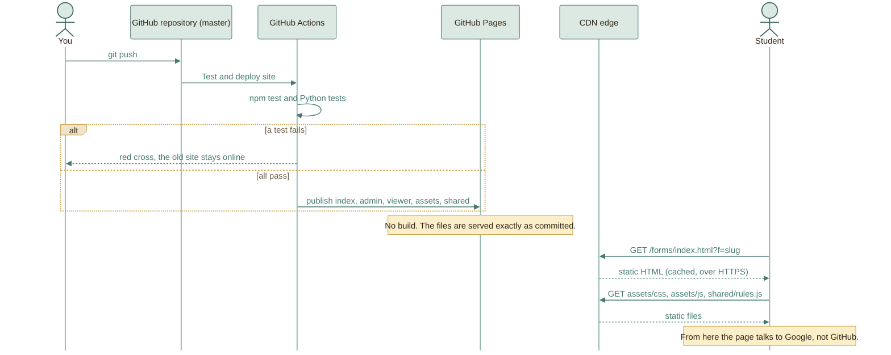
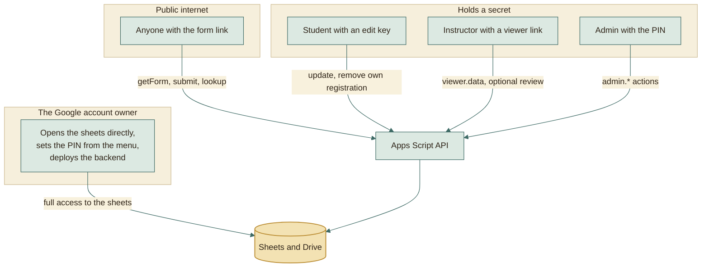
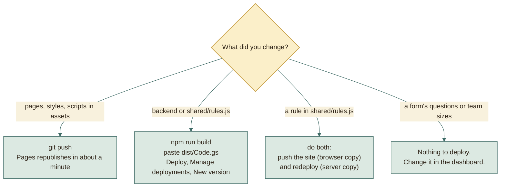

# Hosting: what GitHub does, what Google does, and how they fit

The platform lives in two places on purpose. Understanding the split explains
most of the deployment steps and why updates are easy.

```mermaid
%%{init: {
  'theme': 'base',
  'themeVariables': {
    'fontFamily': 'ui-sans-serif, system-ui, -apple-system, Segoe UI, Roboto, sans-serif',
    'fontSize': '15px',
    'primaryColor': '#DCE9E2', 'primaryBorderColor': '#3F6B66', 'primaryTextColor': '#2F2418',
    'secondaryColor': '#F0E4C8', 'secondaryBorderColor': '#C9A24A', 'secondaryTextColor': '#2F2418',
    'tertiaryColor': '#F6EFDC', 'tertiaryBorderColor': '#CDBB94', 'tertiaryTextColor': '#2F2418',
    'lineColor': '#3F6B66', 'textColor': '#2F2418', 'mainBkg': '#DCE9E2', 'nodeBorder': '#3F6B66',
    'clusterBkg': '#F6EFDC', 'clusterBorder': '#CDBB94', 'titleColor': '#2F2418',
    'edgeLabelBackground': '#F8F1DD',
    'actorBkg': '#DCE9E2', 'actorBorder': '#3F6B66', 'actorTextColor': '#2F2418', 'actorLineColor': '#8FB3AB',
    'signalColor': '#477A73', 'signalTextColor': '#477A73',
    'labelBoxBkgColor': '#F0E4C8', 'labelBoxBorderColor': '#C9A24A', 'labelTextColor': '#2F2418', 'loopTextColor': '#6A5A44',
    'noteBkgColor': '#FBEFC9', 'noteBorderColor': '#C9A24A', 'noteTextColor': '#2F2418',
    'activationBkgColor': '#DCE9E2', 'activationBorderColor': '#3F6B66', 'sequenceNumberColor': '#F8F1DD',
    'transitionColor': '#3F6B66', 'stateLabelColor': '#2F2418', 'stateBkg': '#DCE9E2', 'altBackground': '#F6EFDC',
    'attributeBackgroundColorOdd': '#F8F1DD', 'attributeBackgroundColorEven': '#F0E4C8'
  },
  'flowchart': {'curve': 'basis', 'padding': 14, 'nodeSpacing': 40, 'rankSpacing': 46},
  'sequence': {'mirrorActors': false, 'messageMargin': 34, 'boxMargin': 8}
}}%%
flowchart LR
    subgraph repo["Your GitHub repository"]
        code["Source: pages, assets,<br/>backend, scripts, tests, docs"]
    end
    subgraph pages["GitHub Pages"]
        site["Public website<br/>index, admin, viewer<br/>https://you.github.io/forms/"]
    end
    subgraph google["Your Google account"]
        gas["Apps Script web app"]
        data[("Sheets and Drive")]
    end
    code -- "git push" --> site
    code -. "npm run build, then paste<br/>dist/Code.gs by hand" .-> gas
    site -- "fetch POST JSON" --> gas
    gas --> data
    classDef cDb fill:#F3E2B3,stroke:#B8892D,stroke-width:1.5px,color:#2F2418
    classDef cActor fill:#F4D9D3,stroke:#9A3328,stroke-width:1.5px,color:#2F2418
    classDef cDec fill:#FBEFC9,stroke:#C9A24A,stroke-width:1.5px,color:#2F2418
    classDef cEnd fill:#2F2418,stroke:#2F2418,color:#F8F1DD
    classDef cErr fill:#F6D5CF,stroke:#A12B1F,stroke-width:1.5px,color:#5A140C
    classDef cOk fill:#BFD9CF,stroke:#2E5A55,stroke-width:1.5px,color:#17302D
    class data cDb
```

Two different arrows leave your repository. The website goes through GitHub
automatically. The backend is **not** deployed by GitHub; you paste it into
Google yourself. Everything below follows from that.

## What GitHub does for this project

| Job | How it helps |
|---|---|
| **Hosts the website (GitHub Pages)** | Serves `index.html`, `admin.html`, `viewer.html`, and `assets/` as static files over HTTPS, from a global CDN, for free. |
| **Tests and publishes on every push** | A push to `master` runs the workflow in `.github/workflows/pages.yml`: all JavaScript and Python tests, then a Pages deploy of the website files only. A failing test keeps the old site online. |
| **Keeps the full history** | Every change is a commit. A bad change is undone by reverting it. Old versions of any file are one click away. |
| **Gives you a safety net** | The repository is a complete copy of the project. If your laptop dies, `git clone` brings everything back. |
| **Documents why things changed** | The commit convention (`feat(admin): ...`, merge commits that summarise a branch) makes the history readable. |
| **Makes sharing and review possible** | Others can read the code, open issues, or propose changes with pull requests. |

### What GitHub does *not* do here

| Not done by GitHub | Who does it instead |
|---|---|
| Run backend code | Google Apps Script |
| Store registrations | Google Sheets |
| Keep secrets (PIN, keys, tokens) | Google (script properties and hashed values in sheets) |
| Deploy the backend | You paste `dist/Code.gs` into Apps Script (each Actions run keeps a built copy as the `backend-dist` artifact) |
| Send email | Google MailApp |

Because GitHub only serves files, **nothing secret ever belongs in the
repository**. Nothing is secret there by design: the one value the website
needs, the web app address in `assets/js/config.js`, has to be public anyway,
since every visitor's browser calls it.

## How GitHub Pages serves this project

Why it suits this project:

- **No build step on the site.** The pages are plain HTML, CSS, and JavaScript.
  What you commit is exactly what visitors get, so there is nothing that can
  differ between your computer and the live site.
- **The root folder is the site.** The HTML files sit at the top of the
  repository, and the workflow copies just them, `assets/`, and `shared/` into
  the published artifact. Backend code, tests, scripts, and docs never go online.
- **Tested before it is public.** Pages' source is *GitHub Actions*, so a push
  that breaks a test is never published.
- **No special folders.** Nothing starts with an underscore, so GitHub's
  default processing does not hide or change any file.
- **Free HTTPS.** The page talks to Google over HTTPS, and the clipboard
  feature (Copy key) needs a secure context.
- **Fast everywhere.** A CDN serves the files near the student, which matters on
  mobile data.
- **Independent from the backend.** A website update never touches Google, and a
  backend update never touches GitHub.

## What Google does for this project

| Google service | Role |
|---|---|
| **Apps Script web app** | Runs all backend logic. Its address is the API. Runs as the owner so visitors need no login. |
| **Google Sheets** | The database: one registry sheet plus one sheet per form. Also the admin's spreadsheet view of the data. |
| **Drive** | Holds the `Forms Platform` folder, the form sheets, and exported PDFs. Students' project files stay in their own Drive and are only linked. |
| **MailApp** | Sends confirmation emails with the edit key. |
| **LockService** | Prevents two students taking the same slot. |
| **CacheService** | Counts wrong PIN, key, and token attempts for throttling. |
| **PropertiesService** | Stores the private pepper, the PIN hash, and the registry id. |
| **Triggers** | Runs `processDirtyViews` every five minutes. |

## Who is allowed to do what

## Why split hosting this way

| Alternative | Why it was not chosen |
|---|---|
| Everything on Apps Script (HtmlService pages) | The pages would be served inside a Google iframe with a long address, harder to style, and slower to iterate. Static files are simpler and faster. |
| A rented server or a platform with a free tier that sleeps | Costs money, or needs patching, or has cold starts. |
| Firebase or a similar backend service | Would work, but adds another account, another bill risk, and moves data out of Sheets, where admins already work. |
| Google Forms | Cannot do slots, team size, edit keys, tinted team blocks, or WhatsApp matching. |

The deciding factor: the owner and the instructors already live in Google
Sheets. Keeping the data there means the "database" is a tool they can already
read, filter, and print.

## Failure behaviour

| What fails | What visitors see | What still works |
|---|---|---|
| GitHub Pages is down | The site does not load | Google Sheets and the admin's direct access to the data |
| Apps Script is down or over quota | The pages load, then say "Could not reach the server" and let the student try again | Draft answers are kept in the tab; instructors' printed copies |
| A wrong web app address in `config.js` | "The website is not connected to the backend yet" | Nothing submits until it is fixed |
| Student's connection drops mid-submit | A clear retry message; nothing is half-saved because the write happens in one locked step | Their draft stays in the tab |

## Updating

The last row is the quiet payoff of the whole architecture: most day-to-day
changes (a new term, a new form, a different team size, new time slots) are
**data edits in the dashboard** and need no push and no deploy at all.

## Public repository: is that safe?

Yes, with the usual care:

- The repository contains **no secrets**. The PIN, the pepper, the key hashes,
  and the client token hashes live in Google, never in git.
- The web app address is not secret. Protection comes from the server checks,
  not from hiding the address.
- Do not commit exports (`Tasks_Export/` is git-ignored) because they contain
  student names and codes.
- If you prefer a private repository, check GitHub's current rules: Pages for a
  private repository may require a paid plan. The platform itself is unaffected.
