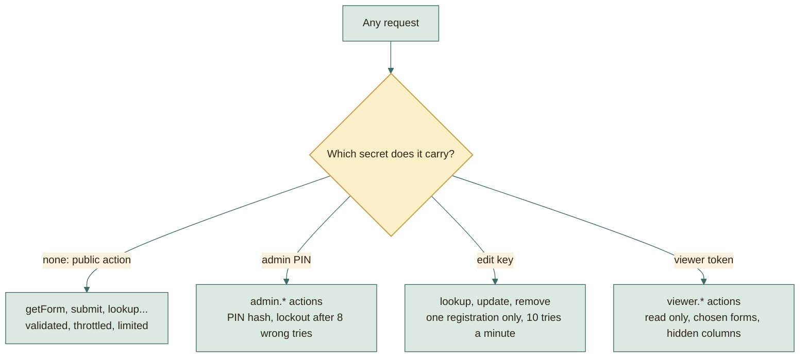
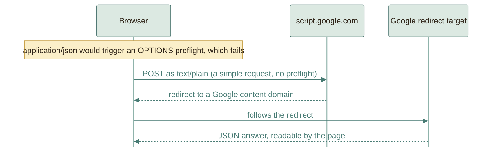
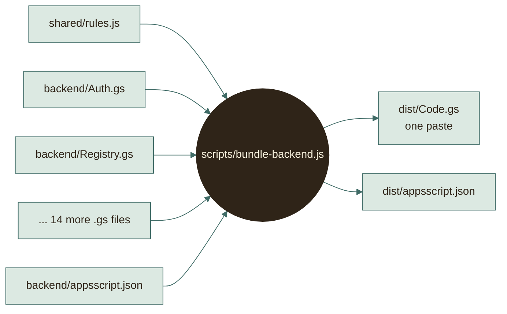
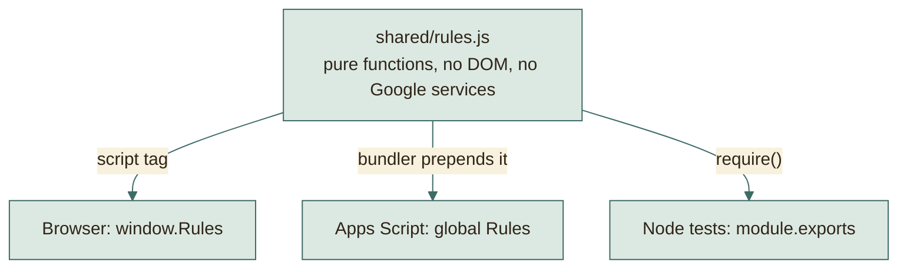
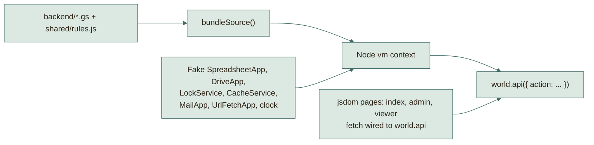
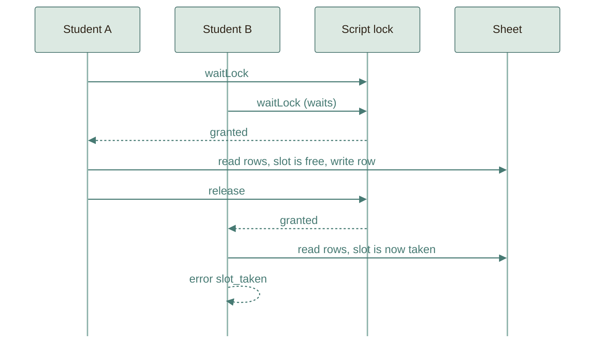
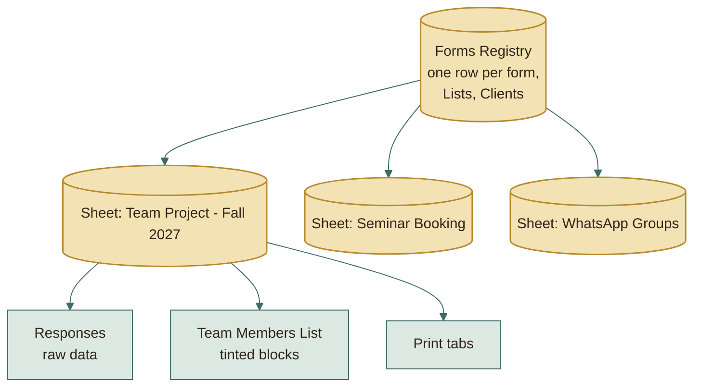

# Workarounds: how the platform gets a lot from free hosting

The deployment guide is short on purpose: paste one file, paste one address,
turn on Pages. That shortness is the result of a series of design decisions,
each made to remove a step or a risk. This document explains every one.

Each section has the same shape:

- **The problem** the free platforms give us
- **The obvious approach** and why it hurts
- **What the platform does instead**
- **The cost**, because every trick has one

## Quick index

| # | Problem | Solution in one line |
|---|---|---|
| 1 | No server | Static pages plus an Apps Script web app |
| 2 | Visitors have no Google login | Script runs as the owner; three small secrets replace accounts |
| 3 | Browsers block cross-site calls | Send plain text so there is no preflight |
| 4 | Apps Script has no modules or npm | A tiny bundler concatenates files into one |
| 5 | Load order of those files is fragile | Every file is order-independent by construction |
| 6 | Rules must match in browser, server, tests | One UMD file loaded in all three |
| 7 | Apps Script cannot be unit tested | An in-memory Google runs the real bundle |
| 8 | Two students, one slot | A script lock plus a re-check inside it |
| 9 | Students have no accounts | A 5-digit key, salted, throttled, expiring |
| 10 | The admin page is public | It is useless without a hashed, rate-limited PIN |
| 11 | Instructors need a view without a login | Private tokens, only the hash stored, columns stripped server-side |
| 12 | Colouring sheets is slow | Format inline when small, defer to a timer when big |
| 13 | One giant sheet becomes a mess | A registry sheet plus one sheet per form |
| 14 | New forms should not need code | The form is data in a single cell |
| 15 | Lists change often | Options are resolved when read, not copied |
| 16 | WhatsApp has no API | Paste, normalise phones, match |
| 17 | Browsers cannot check Drive sharing | The server checks it with the owner's Drive access |
| 18 | PDFs from a script | Export URL with the script's own token, with a fallback |
| 19 | Excel with real files | A local Python script, offline-safe links |
| 20 | Updating without breaking links | A new version of the same deployment |
| 21 | Email problems must not lose data | Mail is best effort and never blocks saving |
| 22 | Deleting must free a code but keep history | Soft delete: a flag, not a removed row |
| 23 | Sheets turns `01012345678` into a number | Every data cell is formatted as plain text |

---

## 1. No server

**Problem.** A form that stores data, sends mail, and checks rules normally
needs a server, a database, and a bill.

**Obvious approach.** Rent a small server or use a paid backend service, then
maintain it.

**What the platform does.** Splits the work between two free services that each
do what they are good at:

```mermaid
%%{init: {
  'theme': 'base',
  'themeVariables': {
    'fontFamily': 'ui-sans-serif, system-ui, -apple-system, Segoe UI, Roboto, sans-serif',
    'fontSize': '15px',
    'primaryColor': '#DCE9E2', 'primaryBorderColor': '#3F6B66', 'primaryTextColor': '#2F2418',
    'secondaryColor': '#F0E4C8', 'secondaryBorderColor': '#C9A24A', 'secondaryTextColor': '#2F2418',
    'tertiaryColor': '#F6EFDC', 'tertiaryBorderColor': '#CDBB94', 'tertiaryTextColor': '#2F2418',
    'lineColor': '#3F6B66', 'textColor': '#2F2418', 'mainBkg': '#DCE9E2', 'nodeBorder': '#3F6B66',
    'clusterBkg': '#F6EFDC', 'clusterBorder': '#CDBB94', 'titleColor': '#2F2418',
    'edgeLabelBackground': '#F8F1DD',
    'actorBkg': '#DCE9E2', 'actorBorder': '#3F6B66', 'actorTextColor': '#2F2418', 'actorLineColor': '#8FB3AB',
    'signalColor': '#477A73', 'signalTextColor': '#477A73',
    'labelBoxBkgColor': '#F0E4C8', 'labelBoxBorderColor': '#C9A24A', 'labelTextColor': '#2F2418', 'loopTextColor': '#6A5A44',
    'noteBkgColor': '#FBEFC9', 'noteBorderColor': '#C9A24A', 'noteTextColor': '#2F2418',
    'activationBkgColor': '#DCE9E2', 'activationBorderColor': '#3F6B66', 'sequenceNumberColor': '#F8F1DD',
    'transitionColor': '#3F6B66', 'stateLabelColor': '#2F2418', 'stateBkg': '#DCE9E2', 'altBackground': '#F6EFDC',
    'attributeBackgroundColorOdd': '#F8F1DD', 'attributeBackgroundColorEven': '#F0E4C8'
  },
  'flowchart': {'curve': 'basis', 'padding': 14, 'nodeSpacing': 40, 'rankSpacing': 46},
  'sequence': {'mirrorActors': false, 'messageMargin': 34, 'boxMargin': 8}
}}%%
flowchart LR
    A["GitHub Pages<br/>good at serving files fast"] --- B["Browser<br/>good at the interface"]
    B --- C["Apps Script<br/>good at logic and talking to Google"]
    C --- D["Sheets and Drive<br/>good at storing rows and files"]
    classDef cDb fill:#F3E2B3,stroke:#B8892D,stroke-width:1.5px,color:#2F2418
    classDef cActor fill:#F4D9D3,stroke:#9A3328,stroke-width:1.5px,color:#2F2418
    classDef cDec fill:#FBEFC9,stroke:#C9A24A,stroke-width:1.5px,color:#2F2418
    classDef cEnd fill:#2F2418,stroke:#2F2418,color:#F8F1DD
    classDef cErr fill:#F6D5CF,stroke:#A12B1F,stroke-width:1.5px,color:#5A140C
    classDef cOk fill:#BFD9CF,stroke:#2E5A55,stroke-width:1.5px,color:#17302D
```



**Cost.** Two systems to know. In return: nothing to patch, nothing to renew,
no card on file.

---

## 2. Visitors have no Google login

**Problem.** Apps Script normally acts as the logged-in visitor. Students would
need Google accounts, and could only touch data they own.

**Obvious approach.** Ask every student to sign in with Google.

**What the platform does.** Deploys the web app as **Execute as: Me, Who has
access: Anyone**. Now every request runs with the owner's permissions and needs
no visitor identity. Because that would be wide open on its own, the platform
adds its own, much smaller, access layer:



**Cost.** The platform, not Google, is now responsible for access control. That
is why [SECURITY.md](../reference/SECURITY.md) exists and why secrets are hashed.

---

## 3. Browsers block cross-site calls

**Problem.** The page lives on `github.io`; the backend lives on
`script.google.com`. Browsers protect users by asking the other site "may I?"
first (a CORS *preflight*, an `OPTIONS` request) whenever a request looks
unusual. Apps Script web apps cannot answer `OPTIONS`, so an ordinary JSON call
would fail.

**Obvious approach.** Add a proxy server, or use JSONP and GET requests with
data in the address (limited size, visible in logs).

**What the platform does.** Browsers skip the preflight for "simple" requests.
A `POST` whose `Content-Type` is `text/plain` is simple. So the page sends JSON
**as plain text**:

```js
fetch(url, {
  method: 'POST',
  headers: { 'Content-Type': 'text/plain;charset=utf-8' },
  body: JSON.stringify(payload),
  redirect: 'follow'
});
```



The backend reads `e.postData.contents` and parses it itself (`doPost` in
`Code.gs`). `redirect: 'follow'` matters because Apps Script answers through a
redirect.

**Cost.** None visible to users. The one caveat is that this behaviour belongs
to Google; the first-run checklist includes a real submission to confirm it on
your account.

---

## 4. Apps Script has no modules and no npm

**Problem.** Apps Script projects are a flat list of files in one shared global
scope. There are no `import` statements, no folders, and nothing like npm.
Also, the validation rules should live outside the backend so the browser can
use them.

**Obvious approach.** Put everything in one huge `Code.gs` and copy the
validation by hand into the website. The two copies drift apart.

**What the platform does.** Keeps the source organised in small files and lets a
30-line script glue them together:



The bundler also **checks the result compiles** before writing it, so a typo
shows up on your computer instead of in the Apps Script editor. Full details in
[BUILD-PIPELINE.md](BUILD-PIPELINE.md).

**Cost.** One extra command (`npm run build`) before a paste. The zip already
contains the built `dist/`, so a first deploy needs no tooling at all.

---

## 5. Load order of concatenated files

**Problem.** When files are glued together, order usually matters: a file that
uses `API` before it exists breaks.

**What the platform does.** Makes order irrelevant by convention. Every file is
one of two things:

1. Plain function declarations. JavaScript hoists these, so in one concatenated
   script they exist everywhere before any line runs.
2. Handler registrations that start with the same safe line:

```js
var API = API || {};
API['admin.clients.list'] = admin(function () { /* ... */ });
```

`var API = API || {}` means "use the table if it exists, otherwise create it",
so whichever file loads first creates it and the rest reuse it. The call to
`admin(...)` works from any file because `admin` is a hoisted declaration, and
it only wraps the handler; the PIN check runs later, per request. The bundler
therefore only needs a stable order (rules first, `Code.gs` last), not a clever
one.

**Cost.** A convention to follow when adding a file (the guide in
[ARCHITECTURE.md](ARCHITECTURE.md#where-to-change-what) shows how).

---

## 6. The same rules in browser, server, and tests

**Problem.** "Arabic letters only", "four name parts", "Egyptian phone", "team
size in range" must behave identically everywhere. Duplicated rules always
drift, and a student would see "valid" on the page and "invalid" from the
server.

**What the platform does.** Writes the rules once, as a *UMD module*: a file
that attaches itself correctly wherever it is loaded.

```js
(function (root, factory) {
  var api = factory();
  if (typeof module === 'object' && module.exports) module.exports = api; // Node tests
  root.Rules = api;                                                        // browser and Apps Script
})(typeof globalThis !== 'undefined' ? globalThis : this, function () { /* pure rules */ });
```



Because the rules are *pure* (they use no browser and no Google objects), they
run anywhere unchanged.

**Cost.** The rules file must stay free of environment-specific code. That
discipline is also what makes it easy to test.

---

## 7. Apps Script cannot be unit tested

**Problem.** The backend calls `SpreadsheetApp`, `DriveApp`, `LockService` and
others that only exist inside Google. Normally that means testing by hand on a
live account.

**What the platform does.** Builds a small, faithful copy of those services in
memory (`tests/harness/appsscript-mock.js`), then loads the **real bundled
`Code.gs`** into it. The tests do not test a copy of the logic; they run the
exact text you will paste.



The page tests go one step further: they open the real HTML pages and route
`fetch` straight into the same world, so browser and backend are tested
together. More in [TESTING.md](../reference/TESTING.md).

**Cost.** The copy can only be as faithful as it is written. That is why real
Drive sharing checks, PDF export, and email are on the first-run checklist.

---

## 8. Two students, one slot

**Problem.** Two students press Send at the same moment for the same time slot.
Both read the sheet, both see the slot free, both write.

**What the platform does.** A **script lock** serialises the critical part, and
the checks are repeated *inside* the lock:



Only the read-check-write section is locked. Slow work (the Drive link check,
the email) happens outside it, so the lock is held for milliseconds.

**Cost.** Writes are one at a time. At classroom scale nobody notices.

---

## 9. Students have no accounts

**Problem.** After submitting, a student must be able to fix a typo or cancel,
but there are no logins.

**What the platform does.** A 5-digit key, shown once, that *alone* opens the
registration. To make a short number safe:

| Measure | Why it helps |
|---|---|
| Stored as `sha256(pepper + form id + key)` | A leaked sheet reveals no keys, and the same key in two forms hashes differently |
| Unique within a form | Two registrations never share a key, so the key identifies exactly one |
| 10 wrong tries a minute per form, silently throttled | 100,000 possibilities cannot be walked through |
| Expires after a number of days you set | A stolen old key stops working |
| Shown once, optionally emailed | A lost key can be read back by the admin from a sealed copy, or replaced |

**Cost.** A lost key needs the admin (Details, then Show key or Reset key).
That is a feature as much as a cost: there is no "forgot key" page to attack.

---

## 10. The admin page is public

**Problem.** `admin.html` is a file on GitHub Pages; anyone can open it.

**What the platform does.** Treats the page as a harmless shell. It holds no
data and no secret. Every admin action is a request that the **backend**
rejects without a correct PIN:

- The PIN is stored only as `sha256(pepper + ':admin:' + pin)`.
- Eight wrong PINs lock **all** admin access for 10 minutes (counted in the
  cache, so the lock cannot be cleared from the browser).
- The PIN is kept only in `sessionStorage`, so closing the tab logs you out.
- The page asks search engines not to index it (`noindex`).

**Cost.** The PIN is the only lock, so choose one that is hard to guess.

---

## 11. Instructors need a view without a login

**Problem.** An instructor should see today's bookings on a phone, without a
Google account or the admin PIN, and without seeing student phone numbers.

**What the platform does.** A private link with a random token. Only the hash of
the token is stored, so a leaked spreadsheet cannot open anyone's view.
Restrictions are applied **on the server**:

```mermaid
%%{init: {
  'theme': 'base',
  'themeVariables': {
    'fontFamily': 'ui-sans-serif, system-ui, -apple-system, Segoe UI, Roboto, sans-serif',
    'fontSize': '15px',
    'primaryColor': '#DCE9E2', 'primaryBorderColor': '#3F6B66', 'primaryTextColor': '#2F2418',
    'secondaryColor': '#F0E4C8', 'secondaryBorderColor': '#C9A24A', 'secondaryTextColor': '#2F2418',
    'tertiaryColor': '#F6EFDC', 'tertiaryBorderColor': '#CDBB94', 'tertiaryTextColor': '#2F2418',
    'lineColor': '#3F6B66', 'textColor': '#2F2418', 'mainBkg': '#DCE9E2', 'nodeBorder': '#3F6B66',
    'clusterBkg': '#F6EFDC', 'clusterBorder': '#CDBB94', 'titleColor': '#2F2418',
    'edgeLabelBackground': '#F8F1DD',
    'actorBkg': '#DCE9E2', 'actorBorder': '#3F6B66', 'actorTextColor': '#2F2418', 'actorLineColor': '#8FB3AB',
    'signalColor': '#477A73', 'signalTextColor': '#477A73',
    'labelBoxBkgColor': '#F0E4C8', 'labelBoxBorderColor': '#C9A24A', 'labelTextColor': '#2F2418', 'loopTextColor': '#6A5A44',
    'noteBkgColor': '#FBEFC9', 'noteBorderColor': '#C9A24A', 'noteTextColor': '#2F2418',
    'activationBkgColor': '#DCE9E2', 'activationBorderColor': '#3F6B66', 'sequenceNumberColor': '#F8F1DD',
    'transitionColor': '#3F6B66', 'stateLabelColor': '#2F2418', 'stateBkg': '#DCE9E2', 'altBackground': '#F6EFDC',
    'attributeBackgroundColorOdd': '#F8F1DD', 'attributeBackgroundColorEven': '#F0E4C8'
  },
  'flowchart': {'curve': 'basis', 'padding': 14, 'nodeSpacing': 40, 'rankSpacing': 46},
  'sequence': {'mirrorActors': false, 'messageMargin': 34, 'boxMargin': 8}
}}%%
flowchart LR
    link["viewer.html?t=TOKEN"] --> api["viewer.data"]
    api --> check{"hash(token) matches an active client<br/>that is allowed this form?"}
    check -- "no" --> deny["bad_token, revoked, or forbidden"]
    check -- "yes" --> strip["remove hidden columns from every row"]
    strip --> send["only allowed data reaches the browser"]
    classDef cDb fill:#F3E2B3,stroke:#B8892D,stroke-width:1.5px,color:#2F2418
    classDef cActor fill:#F4D9D3,stroke:#9A3328,stroke-width:1.5px,color:#2F2418
    classDef cDec fill:#FBEFC9,stroke:#C9A24A,stroke-width:1.5px,color:#2F2418
    classDef cEnd fill:#2F2418,stroke:#2F2418,color:#F8F1DD
    classDef cErr fill:#F6D5CF,stroke:#A12B1F,stroke-width:1.5px,color:#5A140C
    classDef cOk fill:#BFD9CF,stroke:#2E5A55,stroke-width:1.5px,color:#17302D
    class check cDec
    class deny cErr
```



Hidden columns are removed before the data leaves the server, so they cannot be
revealed by opening developer tools. Links can be turned off, replaced, or
deleted at any time.

**Cost.** Anyone who has the link can view; treat it like a shared password.

---

## 12. Colouring sheets is slow

**Problem.** Formatting hundreds of cells in Apps Script takes seconds. If it
ran during a submission, students would wait.

**What the platform does.** Chooses by size, and moves big work off the
student's request entirely:

- Up to **60 rows**: rebuild the tinted views immediately.
- More than 60: set a `dirty:<form id>` flag; a **time trigger every 5 minutes**
  rebuilds flagged forms.

See the diagram in [ARCHITECTURE.md](ARCHITECTURE.md#how-sheet-views-stay-fast).
The data itself is always written first; only the *colouring* is deferred.

**Cost.** On a big form the colours can lag by up to five minutes. The admin
can press **Rebuild sheet** at any time.

---

## 13. One giant sheet becomes a mess

**Problem.** Dozens of forms in one spreadsheet means thousands of mixed rows,
confusing sharing, and one corrupted tab hurting everything.

**What the platform does.** Two levels, so each thing is separate:



Each form's sheet can be opened, shared with a colleague, archived, or deleted
on its own. Its address is stored in the registry.

**Cost.** More files in Drive (kept neatly in one `Forms Platform` folder).

---

## 14. New forms should not need code

**Problem.** Team registration, task submission, reservation, and WhatsApp
registration look similar but differ in details. Hard-coding each means every
new variation is a code change.

**What the platform does.** A form is **data**: a JSON definition with fields,
steps, rules, slots, and review steps, stored in a single cell. Fields carry a
**role** (`name`, `code`, `phone`, `title`, `link`, `slot`, `members`,
`team_size`) so generic code can find what it needs without knowing a form's
exact shape:

```js
Rules.valueByRole(form, data, 'code');   // the leader code, whatever the field is called
Rules.fieldByRole(form, 'team_size');    // the team size question, if the form has one
```

The four form types are just four template functions in `Templates.gs`. The
engine contains no question text.

**Cost.** A little indirection when reading the code; a lot of freedom when
adding forms.

---

## 15. Lists change often

**Problem.** Levels, bylaws, majors, and groups change every term. Copying
their values into every form would make updates a chore and a risk.

**What the platform does.** A form stores only the **name** of a list. The real
options are resolved when the form is read (`resolveOptions_` in
`Registry.gs`), both for students and for server-side validation. Edit the list
once in the dashboard and every form updates immediately. The Lists page shows,
for each list, which forms read it, and can be filtered to the lists one kind of
form uses, so WhatsApp-only lists stay out of the way when editing team forms.

A form can also narrow a list for itself: `rules.majors` keeps only the chosen
specializations when the options are resolved, so a Computers-only form offers
and accepts only Computers, in the browser and on the server, from one setting.

**Cost.** Changing a list also changes what old forms accept. Existing stored
answers are not rewritten.

---

## 16. WhatsApp has no free API

**Problem.** Group join requests cannot be read by a website.

**What the platform does.** Moves the manual step into one paste, then removes
the rest of the manual work. The reviewer pastes the pending list; the platform
pulls every phone number out of each line, normalises it (`+20 10 1234 5678`
and `01012345678` become the same), and matches against what students
submitted. The screen shows the request on the left and the student's details
and timetable preview on the right.

**Cost.** One copy-paste per batch. Not automatic, but it replaces hours of
manual comparing with a click per student.

---

## 17. Browsers cannot check Drive sharing

**Problem.** A student pastes a Drive link, but "anyone with the link can view"
is a setting that only Drive knows. A browser cannot read it. A wrong link
means the instructor opens it later and gets "access denied".

**What the platform does.** The **server** checks. It parses the link, opens the
file or folder with the owner's Drive access, and reads its sharing setting
before accepting the submission. A clear error tells the student exactly what
to change.

The same visit reads the folder's **name**. When a form turns on
`rules.folderName`, `Rules.checkFolderName` requires `Team_Leader_Name_Project_Name_Subject`:
no spaces, at least three parts joined by single underscores, ending with the
subject code. The page shows the rule beforehand with an example built from the
project title the student typed, and the error repeats that example.

**Cost.** The check needs real Google, so it is on the first-run checklist.
The check runs outside the lock, so it never slows other students.

---

## 18. PDFs from a script

**Problem.** Apps Script has no direct "make PDF" button for a sheet range.

**What the platform does.** Builds a dedicated **print tab** on demand (always
fresh), then calls the spreadsheet's own export address with the script's OAuth
token and saves the result in a Drive `Exports` folder. If Google refuses, the
dashboard says so and points to the print tab with *File > Print*, so printing
never fully fails.

**Cost.** PDF export is verified only on a real account.

---

## 19. Excel with real files

**Problem.** An Excel list of tasks is far more useful when each task opens the
actual file. Doing that inside Apps Script means fetching dozens of files and
zipping them under tight runtime limits.

**What the platform does.** Runs it on the admin's own computer. The script asks
the backend for the team list (one request), downloads each file locally, and
builds the workbook. The hyperlinks inside are **relative** (`files/001_Name.pptx`),
so the whole folder can be moved, zipped, or emailed and still work. Anything
that cannot be downloaded is listed on a **Failed** sheet with the reason, and
keeps its original link.

**Cost.** Needs Python once. Relative links open in desktop Excel only.

---

## 20. Updating without breaking links

**Problem.** If every backend change produced a new web app address, you would
have to edit `config.js` and republish every time.

**What the platform does.** Updating means **Deploy > Manage deployments >
Edit > New version** on the *same* deployment, so the address never changes.
The website needs no edit when the backend changes, and the backend needs none
when the website changes. They only agree on the JSON actions.

---

## 21. Email problems must not lose data

**Problem.** Mail can fail (quota, bad address). A student's registration must
not vanish because an email did not send.

**What the platform does.** Sends mail **after** the row is saved and wraps it in
a try/catch that only logs. The ticket page is the primary delivery of the key;
the email is a copy.

---

## 22. Deleting must free a code but keep history

**Problem.** When a team cancels, its leader code and slot must become free,
but you also want a record.

**What the platform does.** Deleting sets a `deleted` flag and clears the key
hash; the row stays in the sheet. Uniqueness and slot checks only look at live
rows, so the code and slot are free immediately. Reference numbers count every
row, so a reference is never reused.

---

## 23. Sheets turns `01012345678` into a number

**Problem.** Google Sheets helpfully converts anything that looks numeric. A
phone number loses its leading zero and a student code can become `4.23E+6`.
Then phone matching and uniqueness checks break silently.

**What the platform does.** Formats every data cell as **plain text** (`@`) when
a tab is created (`ensureTab` for the registry, `attachSheet_` for each form's
Responses). Values are stored exactly as validated, and reads return exactly
what was written. Phone numbers are also normalised by one function
(`Rules.normalizePhone`) before they are stored or compared.

**Cost.** None noticeable. Sorting a plain-text code column sorts as text, which
is correct for fixed-length codes.

---

## The pattern behind all of these

Almost every item above follows one of three moves:

1. **Move the check to where the truth is.** Drive sharing is checked by the
   server because only the server can see it.
2. **Make the secret small and disposable.** A key, a token, a PIN: each is
   hashed, salted, throttled, and replaceable, instead of building accounts.
3. **Keep one copy of anything that must agree.** One rules file, one API
   table, one form definition per form.

Everything else (the bundler, the in-memory test world) exists to make those
three moves cheap and safe.
