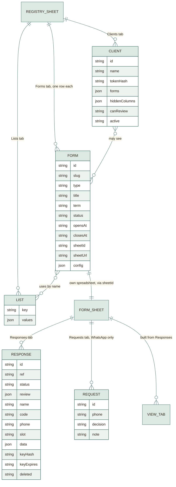

# Data model

Everything is stored in Google Sheets and Apps Script properties. This page
lists every sheet, column, and stored value, and how they relate.

## Overview



## The registry spreadsheet ("Forms Registry")

Created by you, then prepared by **First-time setup**. It is also the
spreadsheet the Apps Script is attached to, which is why the sheet menu exists.

### Forms tab (one row per form)

| Column | Meaning |
|---|---|
| `id` | Internal id, never changes |
| `slug` | The link name used in `?f=` |
| `type` | `team_registration`, `task_submission`, `reservation`, or `whatsapp_registration` |
| `title`, `term` | Heading and the small tag beside it. The dashboard writes the term as a season and a year, for example `Fall 2027` |
| `status` | `draft`, `open`, `closed`, `archived` |
| `opensAt`, `closesAt` | Optional ISO dates |
| `sheetId`, `sheetUrl` | The form's own spreadsheet |
| `config` | **Everything else about the form, as JSON** (see below) |
| `createdAt`, `updatedAt` | ISO timestamps |

The `config` cell is the reason new forms need no code:

| Key | Holds |
|---|---|
| `subject` | Subject code shown beside the title, such as `CMPn323` (letters, digits, dashes, no spaces) |
| `lang` | Default language and whether students see the switch |
| `icon` | `team`, `calendar`, `task`, `chat`, or `none` |
| `fields` | The questions: id, type, role, labels and an optional description (`help`) in English and Arabic, required, enabled, list name, name parts |
| `steps` | How questions are grouped into pages |
| `rules` | `uniqueBy`, `uniqueAcrossForm`, `driveCheck`, `maxSubmissions`, **`teamSize { min, max, notice }`**. `notice` is optional: `{ sizes: [3, 4], text: { en, ar } }`, a note shown to students who pick one of those sizes; `{n}` and `{max}` are filled in |
| `editKey` | `enabled`, `days`, `allowEdit`, `allowDelete` |
| `slots` | Reservation days (id, label, date, times) and `capacity` |
| `review` | Review steps and whether they are sequential |
| `matching` | WhatsApp matching switch |
| `notifications` | `confirmEmail`, `alertEmail` |
| `messages` | Custom text for closed, not-yet, and draft states |

### Lists tab

| Column | Meaning |
|---|---|
| `key` | List name: `levels`, `curricula`, `majors`, `sections`, `groups`, `wa_sections` |
| `values` | JSON array of `{ value, label: { en, ar } }` |

A form's dropdown stores only the list **name**. The options are filled in when
the form is read, so editing a list updates every form that uses it.

### Clients tab (instructor and client links)

| Column | Meaning |
|---|---|
| `id`, `name` | Internal id and the admin's label |
| `tokenHash` | `sha256(pepper + ':client:' + token)`. The token itself is never stored. |
| `forms` | JSON array of slugs, or `["*"]` for all forms |
| `hiddenColumns` | JSON array, for example `["phone","email"]` |
| `canReview` | `1` if the link may mark review steps |
| `active` | `0` when the link is turned off |
| `createdAt` | ISO timestamp |

## A form's own spreadsheet

Created automatically in the **Forms Platform** Drive folder when a form is
created. Named like `Database Team Project Registration Form - Fall 2027`.

### Responses tab (the raw data; do not edit by hand)

| Column | Meaning |
|---|---|
| `id` | Internal id |
| `ref` | Reference shown to the student, such as `TR-2027-0001`. Prefix by type: `TR`, `TK`, `RS`, `WA`. Numbered by row count, so a reference is never reused. |
| `created`, `updated` | ISO timestamps |
| `status` | `new`, `in_review`, `approved`, `rejected`, `done` |
| `review` | JSON: each review step to `pending`, `approved`, or `rejected` |
| `email`, `name`, `code`, `phone`, `title`, `link` | Copies of the answers found by **role**, so the sheet is readable and filterable |
| `slot` | `day-id|time` for reservations |
| `members` | Readable text: `name (code); name (code)` for team forms |
| `data` | **The full validated answers as JSON**: the source of truth |
| `keyHash` | `sha256(pepper + ':key:' + form id + ':' + key)`. Empty after deletion. |
| `keyExpires` | ISO expiry of the key |
| `deleted` | `1` for a cancelled registration; the row stays |

The readable columns are derived from `data` every time a row is saved
(`applyDerived_`). If they ever disagree, `data` wins.

All cells are formatted as **plain text**. That keeps phone numbers such as
`01012345678` and codes from losing their leading zeros or turning into numbers.

### Requests tab (WhatsApp forms only)

| Column | Meaning |
|---|---|
| `id` | Internal id |
| `raw` | The original pasted line |
| `phone` | Normalised phone found in it |
| `label` | The rest of the line, usually the name |
| `added` | ISO timestamp |
| `decision` | `pending`, `approved`, `rejected` |
| `note` | Reviewer's note |

### View tabs (generated; safe to delete, they are rebuilt)

| Tab | For | Layout |
|---|---|---|
| `Team Members List` | Team and task forms | One block per team: heavy border, alternating tint family, star on the leader, one merged project or task cell with its link |
| `Bookings` | Reservations | One block per day in timetable order |
| `Registrations` | WhatsApp forms | Sorted by group and section with review status and a timetable link |
| `Print - ...` | Printing | A tab per printed day or the team list, with a signature column where relevant |

## Script properties (private settings)

Stored by Apps Script itself, not in any sheet:

| Property | Holds |
|---|---|
| `PEPPER` | A long random value created once. It salts every stored hash. |
| `ADMIN_PIN_HASH` | `sha256(pepper + ':admin:' + pin)` |
| `REGISTRY_ID` | The registry spreadsheet's id |
| `ROOT_FOLDER_ID` | The `Forms Platform` Drive folder |
| `SITE_URL` | Your website address, used in emails |
| `dirty:<form id>` | A flag meaning "rebuild this form's views on the next timer run" |

## Short-lived counters (CacheService)

| Key | Purpose | Limit |
|---|---|---|
| `admin_fails` | Wrong admin PINs | 8 then locked 10 minutes |
| `badkey:<form id>` | Wrong edit keys on a form | 10 per minute |
| `bad_tokens` | Wrong viewer tokens | 30 per minute |

Counters live in the cache and expire on their own, so they cost no sheet
writes and cannot be reset from the browser.

## Browser storage

| Where | Key | Holds | Lasts |
|---|---|---|---|
| `sessionStorage` | `fp_draft_<slug>` | The student's unsent answers | Until the tab closes |
| `sessionStorage` | `fp_admin_pin` | The admin PIN for this tab | Until the tab closes |
| `localStorage` | `fp_theme` | Light, dark, or follow the device | Until cleared |
| `localStorage` | `fp_lang` | English or Arabic | Until cleared |

## How a registration is shaped

Example for a team of three (`team_size` is the total, including the leader):

```json
{
  "email": "sara@example.com",
  "leader_name": "أحمد محمد محمود أحمد",
  "leader_code": "4230999",
  "phone": "01012345678",
  "major": "حاسبات",
  "level": "صفر / الأولى",
  "section": "4C-TH1",
  "curriculum": "2020",
  "team_size": "3",
  "members": [
    { "name": "سارة خالد حسن علي", "phone": "01112345678", "code": "4230998", "level": "صفر / الأولى", "curriculum": "2020", "section": "4C-TH1" },
    { "name": "منى أشرف كمال فؤاد", "phone": "01212345678", "code": "4230997", "level": "صفر / الأولى", "curriculum": "2020", "section": "4C-TH1" }
  ],
  "title": "Library System"
}
```

The rule `members.length == team_size - 1` is enforced by `Rules.validateSubmission`
in the browser, on the server for students, and on the server for admin edits.
