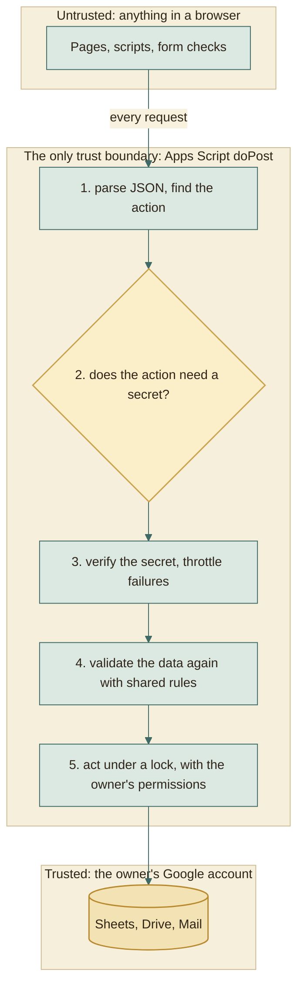

# Security

A free, account-less platform has to be careful about who can do what. This
page lists the secrets, where each lives, what protects it, and where the
honest weak spots are.

## The model in one picture

Rule of the whole design: **the browser is a convenience, never a guard.** The
page's checks give instant feedback; the server repeats every one of them.

## Secrets inventory

| Secret | Who holds it | Stored as | Protected by | If it leaks |
|---|---|---|---|---|
| Admin PIN | The admin | `sha256(pepper:admin:pin)` in script properties | Lockout after 8 wrong tries for 10 minutes | Full admin access. Run **Set admin PIN** from the sheet menu to replace it. |
| Edit key (5 digits) | One student, and the admin on request | `sha256(pepper:key:formId:key)` plus a sealed copy (`keySeal`, digits shifted by `sha256(pepper:seal:formId:responseId)`) in the Responses row | Per-form throttle of 10 wrong tries a minute, expiry; only the backend can unseal, only for the PIN | One registration can be edited or cancelled. Admin: **Details, Reset key**. |
| Viewer token (24 characters) | One instructor or client | `sha256(pepper:client:token)` in the Clients tab | Random, throttled at 30 wrong tries a minute, revocable | Read access to the forms and columns of that link. Turn it off or make **New link**. |
| Pepper | Apps Script only | Script property `PEPPER`, created once | Never leaves Google | Hashes could be attacked offline. Not exposed by any action. |
| Web app address | Everyone | Actions `API_URL` variable; generated published `assets/js/config.js` | Not secret by design | Nothing: it is only an entry point. |

The pepper is a long random value mixed into every hash. A leaked spreadsheet
alone therefore reveals no PIN, key, or token that could be tested offline.

## What each audience can do

| Audience | Can | Cannot |
|---|---|---|
| Anyone with a form link | Read the public form definition, submit if the form is open | See any other registration, or the admin pages' data |
| Student with a key | Read, change, or cancel **their own** registration | Open anyone else's; the key identifies exactly one row |
| Instructor with a link | Read chosen forms through chosen columns; review steps only if allowed | Edit data, delete, or see hidden columns |
| Admin with the PIN | Everything through the dashboard, including reading a student's current key | Read a key without the PIN, or a key for a cancelled registration |
| Sheet owner | Everything, directly in Google | n/a |

## Defences, layer by layer

```mermaid
%%{init: {
  'theme': 'base',
  'themeVariables': {
    'fontFamily': 'ui-sans-serif, system-ui, -apple-system, Segoe UI, Roboto, sans-serif',
    'fontSize': '15px',
    'primaryColor': '#DCE9E2', 'primaryBorderColor': '#3F6B66', 'primaryTextColor': '#2F2418',
    'secondaryColor': '#F0E4C8', 'secondaryBorderColor': '#C9A24A', 'secondaryTextColor': '#2F2418',
    'tertiaryColor': '#F6EFDC', 'tertiaryBorderColor': '#CDBB94', 'tertiaryTextColor': '#2F2418',
    'lineColor': '#3F6B66', 'textColor': '#2F2418', 'mainBkg': '#DCE9E2', 'nodeBorder': '#3F6B66',
    'clusterBkg': '#F6EFDC', 'clusterBorder': '#CDBB94', 'titleColor': '#2F2418',
    'edgeLabelBackground': '#F8F1DD',
    'actorBkg': '#DCE9E2', 'actorBorder': '#3F6B66', 'actorTextColor': '#2F2418', 'actorLineColor': '#8FB3AB',
    'signalColor': '#477A73', 'signalTextColor': '#477A73',
    'labelBoxBkgColor': '#F0E4C8', 'labelBoxBorderColor': '#C9A24A', 'labelTextColor': '#2F2418', 'loopTextColor': '#6A5A44',
    'noteBkgColor': '#FBEFC9', 'noteBorderColor': '#C9A24A', 'noteTextColor': '#2F2418',
    'activationBkgColor': '#DCE9E2', 'activationBorderColor': '#3F6B66', 'sequenceNumberColor': '#F8F1DD',
    'transitionColor': '#3F6B66', 'stateLabelColor': '#2F2418', 'stateBkg': '#DCE9E2', 'altBackground': '#F6EFDC',
    'attributeBackgroundColorOdd': '#F8F1DD', 'attributeBackgroundColorEven': '#F0E4C8'
  },
  'flowchart': {'curve': 'basis', 'padding': 14, 'nodeSpacing': 40, 'rankSpacing': 46},
  'sequence': {'mirrorActors': false, 'messageMargin': 34, 'boxMargin': 8}
}}%%
flowchart LR
    subgraph L1["Input"]
        i1["Server re-validates every answer"]
        i2["Arabic-only, English-only, phone, code, team size rules"]
        i3["Drive link must open and be shared"]
    end
    subgraph L2["Identity"]
        a1["PIN hash with lockout"]
        a2["Key hash, per form, unique, expiring"]
        a3["Token hash, revocable"]
    end
    subgraph L3["Abuse"]
        b1["Throttles in CacheService"]
        b2["Form limits: max submissions, one code per team"]
        b3["Script lock: no double booking"]
    end
    subgraph L4["Exposure"]
        e1["Hidden columns removed on the server"]
        e2["Export omits phones and key data"]
        e3["Pages are noindex, secrets never in git"]
    end
    L1 --> L2 --> L3 --> L4
    classDef cDb fill:#F3E2B3,stroke:#B8892D,stroke-width:1.5px,color:#2F2418
    classDef cActor fill:#F4D9D3,stroke:#9A3328,stroke-width:1.5px,color:#2F2418
    classDef cDec fill:#FBEFC9,stroke:#C9A24A,stroke-width:1.5px,color:#2F2418
    classDef cEnd fill:#2F2418,stroke:#2F2418,color:#F8F1DD
    classDef cErr fill:#F6D5CF,stroke:#A12B1F,stroke-width:1.5px,color:#5A140C
    classDef cOk fill:#BFD9CF,stroke:#2E5A55,stroke-width:1.5px,color:#17302D
```

### Details worth knowing

- **Throttling is silent for keys.** A wrong key and a throttled key look alike
  to a casual guesser; only the message differs after the tenth try in a minute.
- **Per-form key salt.** The form id is part of the key hash, so the same five
  digits in two forms hash to different values, and a hash from one form is
  useless in another.
- **Unique keys.** `issueKey_` refuses to issue a key whose hash already exists
  in the form, so a key always identifies exactly one registration.
- **Deleting a form** needs the PIN and the form's link name sent back as a
  second key (`confirm`), so a stray or replayed call cannot delete one. Its
  sheet goes to the Drive trash rather than being destroyed.
- **Sealed keys.** The admin can read a key back because the row also holds a
  sealed copy. It is useless without the pepper, which never leaves Apps Script,
  and each registration has its own pad, so two sealed keys cannot be compared.
  Cancelling clears it along with the hash.
- **Cleaning up.** Cancelling clears the key hash, so a cancelled registration's
  key stops working at once.
- **No cookies, no sessions.** Every request carries its own secret, so there is
  nothing for a third-party site to ride on (no cross-site request forgery
  surface), and nothing to hijack.
- **Rendering.** The pages build elements with `textContent` and text nodes, not
  by pasting student text into HTML. The only `innerHTML` use is for the app's
  own fixed icon shapes. A student cannot inject script through a name or title.
- **Admin PIN in the browser.** Kept in `sessionStorage` for the current tab only
  and sent with each admin request. Closing the tab forgets it.

## Honest weak spots

| Weak spot | Why it exists | Mitigation |
|---|---|---|
| `admin.html` is public | Free static hosting has no private area | It holds no data; every action needs the PIN; lockout; `noindex` |
| An attacker can lock the admin out for 10 minutes by guessing wrong 8 times | The lockout counts attempts globally, so it cannot be bypassed from a browser | Wait, or the owner can still work directly in the sheets |
| A 5-digit key is short | Students must type it on a phone | Salted per form, 10 tries a minute, expiry, shown once |
| A viewer link is a bearer secret | No accounts for instructors | Revocable; hidden columns; send it privately; make a new link if shared widely |
| The script holds broad Google permissions | It must read students' linked files and manage the platform folder | The manifest lists scopes explicitly; the script is yours; only the owner can change it. The Drive scope is full because checking sharing on arbitrary student links needs it. |
| Student data lives in the owner's Google Drive | That is the database | Share each form's sheet only with people who need it |
| Email goes through the owner's mail quota | Apps Script MailApp | Mail is best effort and never blocks a submission |
| Real Google behaviour is not covered by local tests | Tests use a faithful copy | First-run checklist in [DEPLOY.md](../DEPLOY.md) |

## If the pepper or properties are lost

Script properties hold the pepper and the PIN hash. If they are deleted:

| Item | Effect | Recovery |
|---|---|---|
| Admin PIN | Stops working | Menu: **Forms Platform, 2. Set admin PIN...** |
| Edit keys | Old keys no longer match | **Details, Reset key** per registration |
| Viewer links | Old links stop working | **Clients, New link** |
| Registrations and forms | Unaffected: they are plain data in the sheets | None needed |

## Privacy

| Data | Where | Who can see it |
|---|---|---|
| Names, codes, phones, emails | The form's own Google Sheet | The sheet owner, anyone the owner shares it with, the admin dashboard, and instructors through links with those columns shown |
| Task files | The student's Drive | Whoever the student shared the link with; the export downloads them using the shared link |
| Excel export | The admin's laptop | The admin. It contains names and codes but no phone numbers. Do not commit it (`Tasks_Export/` is git-ignored). |

## Operational checklist

- [ ] Choose a PIN that is not a birthday or a repeated digit
- [ ] Share each form's Google Sheet with the minimum number of people
- [ ] Give instructors links with phone and email hidden unless they need them
- [ ] Turn off a viewer link when its term ends
- [ ] Keep `Tasks_Export/` out of git and out of shared folders
- [ ] After changing the Apps Script, deploy a **New version** of the same deployment
- [ ] Revisit the quota page in Google if you expect hundreds of confirmation emails a day
