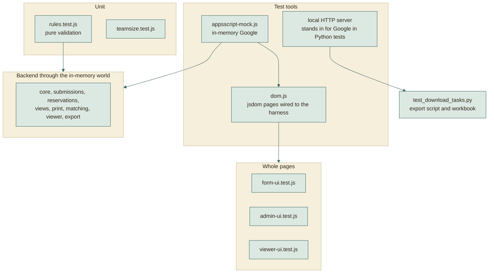
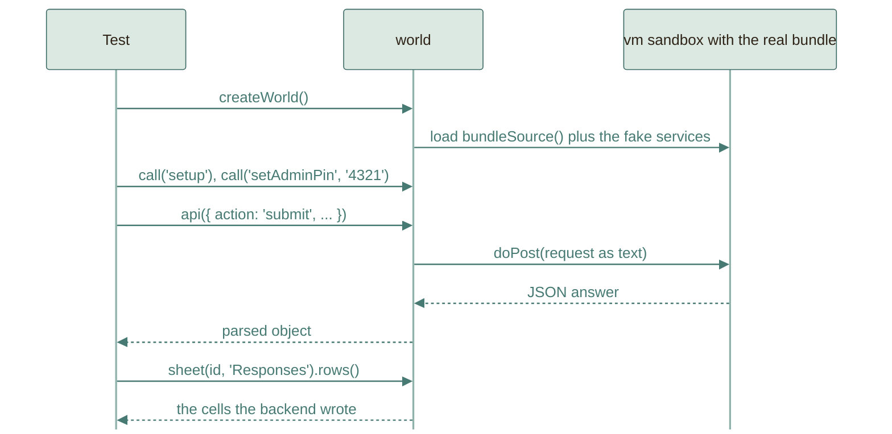

# Testing

165 automated tests run without a Google account, a browser, or a network.
They run the **real** backend and the **real** pages. This page explains how
that works and what it can and cannot prove.

```
npm test                                              # 145 JavaScript tests
python3 -m unittest discover -s tests -p "test_*.py"  # 20 Python tests
```

## The layers



Higher layers reuse lower ones: a page test types into the real page, the page
calls `fetch`, and `fetch` lands in the same in-memory backend the backend tests
use. A bug anywhere between the keyboard and the sheet is caught in one test.

## The in-memory Google

`tests/harness/appsscript-mock.js` implements just enough of Google's services
for the code to run unchanged:

| Fake | Behaves like |
|---|---|
| `SpreadsheetApp` | Spreadsheets, tabs, ranges, values, merges, backgrounds, borders |
| `DriveApp` | Files and folders with sharing access, configurable per test |
| `LockService`, `CacheService`, `PropertiesService` | Locks, expiring counters, stored properties |
| `MailApp` | Collects sent messages so tests can read them |
| `UrlFetchApp` | Configurable network answers, used for the PDF export |
| `Utilities`, `ContentService`, `ScriptApp` | Hashing, UUIDs, dates, JSON output, triggers |
| The clock | `w.setNow(...)`, so key expiry and form dates are tested without waiting |

The harness exposes `world.api(request)` (the same call a browser makes),
`world.call('functionName')` (run any backend function by name, such as
`setup` or `setAdminPin`), and `world.sheet(id, tab)` (read cells back).



## Page tests with jsdom

`tests/harness/dom.js` opens `index.html`, `admin.html`, or `viewer.html` in
jsdom, evaluates the real script tags in order, and replaces `fetch` with a
function that calls `world.api`. Helpers `type`, `pick`, `click`,
`clickText`, `submitForm`, and `settle` drive the page like a person would.

## What is covered

| Area | Tests | Examples |
|---|---:|---|
| Shared rules | 15 | Arabic filtering, name parts, phones, codes, Drive links, slots, form state |
| Team size | 12 | Required question, range, exact member count, admin range, conflicts warning |
| Core and forms | 11 | Setup, PIN lockout, forms CRUD, duplicate, templates |
| Submissions | 17 | Submit, edit keys, expiry, throttling, duplicates, Drive checks, limits, emails |
| Reservations | 11 | Slots, capacity, one booking per leader, orphan warning |
| Sheet views | 7 | Tinted blocks, leader star, merged task cell, bookings by day |
| Print | 7 | Print tabs, signature column, PDF success and fallback |
| Matching | 6 | Paste, normalise, matched, none, duplicate, sequential review |
| Viewer API | 9 | Tokens, hidden columns, today and by day, review rights, revoked links |
| Export API | 3 | Teams with members, no phones, PIN required, deleted left out |
| Student page | 21 | Steps, filters, team size picker, slots, review, ticket, edit by key, themes, Arabic |
| Admin page | 15 | Login, create, team size settings, locked fields, tinted blocks, matching, clients, lists |
| Instructor page | 7 | Today, by day, hidden columns, review rights, invalid links |
| Harness | 4 | The fake itself |
| Excel export (Python) | 20 | Link parsing, downloads, virus-scan page, workbook layout, merged cells, Failed sheet |

## What is not covered, and how to cover it

| Gap | Why | How to cover it |
|---|---|---|
| Real Drive sharing check | Needs real Drive files | First-run checklist in [DEPLOY.md](../DEPLOY.md) |
| Real PDF export | Needs Google's export endpoint | Same checklist |
| Real email delivery and quotas | Needs real mail | Submit once with your own email |
| The 5-minute timer firing | Tests confirm setup installs the trigger once and call `processDirtyViews` directly, but cannot make Google fire it | Check **Triggers** in Apps Script after setup |
| Google's cross-site redirect behaviour | Needs a real web app | A real submission from the live site |
| Fonts and exact visuals | jsdom does not render | Look at the page, or use the screenshot scripts below |
| Excel rendering | Cell properties are asserted, not drawn | Open `Tasks.xlsx`; it was also rendered to an image during development |

The first-run checklist exists because these gaps are real. Everything else is
exercised on every run.

## Adding a test

1. Pick the lowest layer that can see the behaviour: a rule goes in
   `rules.test.js`, a backend behaviour in a backend test, a screen behaviour in
   a page test.
2. Start a world: `const w = createWorld(); w.call('setup'); w.call('setAdminPin', '4321');`
3. Make a form with the admin API, submit through `w.api(...)`, assert on the
   JSON answer and on `w.sheet(...)`.
4. For a page, `openPage('index.html', w, { query: '?f=slug' })`, then drive it
   with the helpers and `await settle()`.

A good test states one behaviour in its name, for example
`Team size: the chosen size decides exactly how many member forms are needed`.

## Why this design

- **Fast.** The suite finishes in a few seconds, so it can run on every change.
- **Honest.** It runs the exact text you paste, via the same `bundleSource()`
  the build uses.
- **Cheap to extend.** The fake is small, and tests read like user stories.
- **Safe.** No test touches a real account, so nothing can send a real email or
  modify real data.
